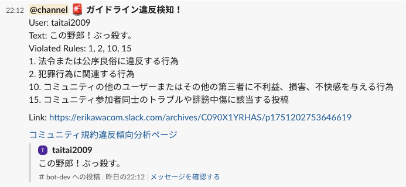

# PJT10 Slack内の投稿からQ&Aを作成するアプリ

`Code Name: pjt10-slack-qa-bot`

このリポジトリは、松尾・岩澤研講義「AIエンジニアリング実践講座2025」の最終課題プロジェクト(PJT10)の成果物の一つであり、
以下課題解決のために設計・開発・実装・評価したBot アプリおよびスクリプト群です。
PJT10は、PJT09で実装した機能を拡張することにより実現しています。

## 目次

## 1. プロジェクト発注書

- 以下の発注書をご参照
- https://docs.google.com/document/d/1A4aoFvFS1E389t7XuXS_D9HPveTVTNw-iAlxepGqpb4/edit?tab=t.0

[🔝 トップに戻る](#目次)

---

## 2. 要件定義・設計

### 2-1. 開発用に作成する Slack ワークスペース

- 開発には *PJT09と同様* 個人利用の Slack ワークスペースを利用。以下のチャネルを新設。
- `#bot-dev` 雑談用チャネル --- 普段使いに使用。全員参加。
- `#bot-qa-dev` 質問・回答用チャネル --- 質疑応答に使う。全員参加。
- `#bot-admin-dev` 運営用チャネル --- 運営担当者限定チャネル

  

### 2-3. Slack ワークスペース上での要件

1. 質問が多いものを Q＆A としてまとめる
   - 質問・回答用チャネルの過去7日分の質問・回答を対象とし、以下を日次で実行する。(毎朝5:00)
   - 質問・回答用チャネルでの各質問文を OpenAI の埋め込みモデル`ext-embedding-3-small`でベクトル化し、コサイン類似度を計算し、階層的クラスタリングを実施。
   - クラスタリングには、当初 DBSCAN を用いていたが、分類が難しかったため、AgglomerativeClustering を採用。
   - 出来上がったクラスタ内の質問を LLM に対して意図を失わないようにまとめる指示を出し、代表質問を作成。
   - 代表質問は、RAGの手法を使って、すでにある、受講の手引きやよくある質問の Notion サイトのコンテンツと類似のものを探そうとしたが、Notion サイトのスクレイピングが難しく断念。
   - Notion サイトのよくある質問の部分だけ、Q＆A 形式で JSONL ファイルにして、このファイルをRAGに使うことにした。
   - 代表質問をベクトル化し、上記 JSONL ファイルの質問部分をベクトルとのコサイン類似度検索を行い、閾値を越えたら一致として、受講の手引き内の回答を、代表質問の回答とした。
   - コサイン類似度検索でマッチしなかった代表質問に対しては、もとのクラスタ内の回答を適切な形でまとめるよう指示をし、代表質問の回答とした。
   - 上記を有効な全てのクラスタに対して実行し、受講生から質問が多い (類似する) Q&A としてまとめる。データベースに記録。
   - まとめた結果は、日次で、「過去7日間のよくある質問(FAQ)」として、Slack 運営用チャネルと Notion の「コミュニティトレンド分析」ページに掲載。
   - ただし、新規の質問が 10 件以上ない場合は、上記の作成は実行しない。Slack と Notion ページは更新するが、内容は変わらない。

2. 受講生の興味が高いトピックスのトレンド表示
   - 雑談用チャネル、質問・回答用チャネルの過去7日分の投稿を対象とし、以下を日次で実行する。(毎朝5:00)
   - 上記チャネルでの各投稿文を OpenAI の埋め込みモデル`ext-embedding-3-small`でベクトル化し、コサイン類似度を計算し、階層的クラスタリングを実施。
   - 投稿数3件以上のクラスタのみ「有効クラスタ」として採用。
   - 投稿数の多い順にソートして、上位 5 クラスタを選択。
   - 上位クラスタのテキストを LLM にて、5〜8語程度のトピック名として生成するよう指示し、出来上がったトレンドトピックはデータベースに登録。
   - トレンドトピックは、日次で、「過去7日間のトレンドトピック5位」として、Slack 運営用チャネルと Notion の「コミュニティトレンド分析」ページに掲載。
   - ただし、新規の質問が 10 件以上ない場合は、上記の作成は実行しない。Slack と Notion ページは更新するが、内容は変わらない。

3. 受講生に多く求められている情報をまとめて運営にアラート
   - 雑談用チャネル、質問・回答用チャネルの過去7日分の投稿を対象とし、以下を日次で実行する。(毎朝5:00)
   - 上記チャネルでの各投稿文を OpenAI の埋め込みモデル`ext-embedding-3-small`でベクトル化し、コサイン類似度を計算し、階層的クラスタリングを実施。
   - 投稿数3件以上のクラスタのみ「有効クラスタ」として採用。
   - 各有効クラスタの投稿文が、情報を求めているか、LLM に判定させて、クラスタ内で「Yes」の割合が 70％ 以上であれば、そのクラスタ全体を「情報リクエストあり」と判定。
   - 情報リクエストと判定されたクラスタに対し、クラスタ内の個々の要望を 5～8 語程度の箇条書きフレーズに要約するようLLM に指示し、出来あがった、受講生から多く求められている情報を、データベースに登録。
   - 受講生から多く求められている情報は、日次で、「受講生から多く求められている情報(過去7日間分)」として、Slack 運営用チャネルの全員に通知 (アラート) し、合わせて Notion の「コミュニティトレンド分析」ページに掲載。
   - ただし、新規の質問が 10 件以上ない場合は、上記の作成は実行しない。Slack と Notion ページは更新するが、内容は変わらない。

4. 松尾・岩澤研のコミュニティガイドライン規約に違反している投稿 (PJT09の要件) に加え、受講生間のトラブル・誹謗中傷などの投稿 (PJT10の要件) を検知した場合、運営用チャネルにてチャネル参加者全員宛に、違反があった旨、以下を即時通知する。
    - ユーザー名
    - 違反した投稿内容
    - 違反に該当したガイドラインの番号とそのガイドラインの内容
    - 投稿のURL
    - ガイドライン規約違反傾向分析ページ (Notion) のURL


### 2-4. データベース

- 本プロジェクトではデータベースとして、構築が容易な SQLite3 を利用する。
- 本プロジェクトでのデータは、PJT09のスキーマに加え、`extracted_items`、`extracted_item_types`、`import_state`、`trend_topics`、`info_requests`を利用する。
- データベーススキーマは、`db_init.py` にて定義する。
- なお、本プロジェクトにおいては、投稿内容自体は、`slack_posts`に格納する。(投稿は、Slack APIにより照会が可能であるが、LLM のプロンプトに投稿文を入れることが多いため、APIのrate limitになってしまうことが多かったことが背景。)


### 2-5. LLMの利用

- LLMはAPI経由で利用する。なお、運営用チャネルでの投稿に対しては、LLMは利用しない。利用シーンは、上記１の通り。

### 2-6. LLM APIプロバイダー比較 (PJT09と同じなので割愛)

### 2-7. LLM利用時のプロンプト設計

以下のLLM利用シーンにおいては、それぞれ以下のようにプロンプトを設計した。

1. クラスタリング後の有効クラスタの中の質問文から、代表質問を作る(日次) --- `llm_helpers.py`で定義
    - システムプロンプト：
      - あなたはコミュニティ参加者からの質問・回答をとりまとめるアシスタントです。
    - ユーザープロンプト：
      - 以下の質問は類似しています。これらの質問をまとめて、コミュニティ参加者が共通に疑問に思っていることを、代表的な質問として、1つに要約してください。出力は質問だけにしてください。
      - `質問文`を列記

2. クラスタリング後の有効クラスタの中の投稿文から、共通のトピックを作る(日次) --- `llm_helpers.py`で定義
    - システムプロンプト：
       - あなたはコミュニティ参加者からの質問・投稿をとりまとめ、代表的なトピックを抽出するアシスタントです。
    - ユーザープロンプト：
       - 以下の投稿は類似した投稿で、コミュニティが興味を持つトピックに関するものです。これらの投稿から、コミュニティが興味を持つトピックを表す短いフレーズを1つ抽出してください。出力は5〜8語の短いフレーズにしてください。
       - `投稿文`を列記

3. クラスタリング後の有効クラスタの中の投稿文から、情報をリクエストしているかの判定(日次) --- `llm_helpers.py`で定義
    - システムプロンプト：
      - あなたはコミュニティに投稿されるコンテンツを分類するプロフェッショナルです。
    - ユーザープロンプト： 
      - 以下の投稿は類似した投稿です。これら投稿は、コミュニティ参加者が、明確に何かを知りたい、何かを学びたいといった情報を求めるリクエストになっていかどうかを「はい」または「いいえ」で、それぞれ新しい行で回答してください。
      - 以下の投稿一覧に対し、各投稿が情報リクエストかどうかを「はい」または「いいえ」で、それぞれ新しい行で回答してください。
      - 投稿一覧:
      - `投稿文`を列記

4. 3で、「はい」判定された複数の投稿に対し、どんな情報を求めているのかまとめさせる(日次) --- `llm_helpers.py`で定義
    - システムプロンプト：
      - あなたはコミュニティ投稿から情報リクエストを抽出するプロフェッショナルです。
    - ユーザープロンプト：
      - 以下の投稿は情報を求めるリクエストです。何を知りたいか、何を学びたいのか、5〜8語のフレーズでまとめてください。
      - 投稿一覧:
      - `投稿文`を列記

5. 講義の手引きなどすでにあるFAQと、代表質問が類似する複数の質問とその回答に対して、回答を1つの文章にさせる(日次)
    - システムプロンプト：
      - あなたはコミュニティ参加者からの質問・回答をとりまとめるアシスタントです。
    - ユーザープロンプト：
      - 質問: `代表質問`
      - コミュニティに関するFAQにある質問と類似する上記の質問に対して、以下の回答を参考にして、この質問に対する有用な回答を1つの文章でまとめてください。
      - FAQでから選ばれた`回答`を列記

6. 講義の手引きなどすでにあるFAQと、代表質問が類似しなかった場合、クラスタ内の回答から、1つの回答を作る(日次)
    - システムプロンプト：
      - あなたはコミュニティ参加者からの質問・回答をとりまとめるアシスタントです。
    - ユーザープロンプト：
      - 以下のコミュニティ参加者からの質問と返信を参考に、質問に対する有用な回答を1つの文章でまとめてください。
      - 質問: `代表質問`
      - クラスタ内の`回答`を列記    

### 2-8. プロダクトの性能・非機能要件の評価

- プロジェクト完了時に、以下について評価する
  - バッチ処理や各種コマンドの応答速度
  - 日次レポートの自動生成処理の実行速度
  - ログ監査・トレーサビリティの担保
  - セキュリティ
  - LLMの性能計測
    - 上記利用シーンでの出力の評価
    - 実行時間

### 2-9. プロジェクトの成功・失敗の定義

- 以下成功と失敗の条件を定義した上で、プロジェクト完了時に評価を行う。
- **成功条件**
  - LLMによる自動評価と自身による定性的な評価の一致率が高い。
  - 日次どで正しいレポートが自動生成される。
- **失敗条件**
  - LLMによる生成結果が意図から大きくズレている
  - パフォーマンスやコストなど、運用に耐えない場合

[🔝 トップに戻る](#目次)

---

## 3. 開発・実装

### 3-0. Bot アプリインストールの前提条件

- Python 3.9以上がインストールされていること(Ubuntu 24.4LTS, Python 3.12.3 で動作確認済)
- `pip install -r requirements.txt` で依存ライブラリをインストール
- `.env` ファイルに必要な環境変数を設定

### 3-1. Slack 側の準備 (PJT09と同じため割愛)

### 3-2. Notion 側の準備 (PJT09と同じため割愛)

### 3-3. Bot アプリのインストール (PJT09と同じため割愛)

### 3-4. ファイル・ディレクトリ構成

- 典型的な構成: (PJT10用に作成したものはその旨表記)

  ```bash
  pjt09-slack-monitor-bot/
  ├── app.py                    ← Bot アプリ本体
  ├── publish_master_upsert.py  ← DB更新スクリプト(*)
  ├── publish_user_metrics.py   ← 貢献度可視化画像の作成、アップロード、Notion への埋め込み(*)
  ├── violation_trends.py       ← ガイドライン違反状況可視化画像の作成、アップロード、Notion　への埋め込み(*)
  ├── requirements.txt          ← Python依存パッケージ一覧
  ├── .env                      ← 環境設定ファイル
  ├── utils/
  │   ├── classifier.py         ← キーワード・LLMによる投稿のポジティブ／違反判定ロジック
  │   ├── constants.py          ← 貢献度計算用の重み設定
  │   ├── db.py                 ← SQLite3 DB照会・更新のラッパー
  │   ├── guidelines.txt        ← LLM API のプロンプトに組み込むコミュニティ規約一覧
  │   ├── llm_judge.py          ← LLM API を用いたリアクション判定の処理
  │   ├── scoring.py            ← 投稿数・リアクション数などから貢献度スコアを計算するロジック
  │   ├── slack_helpers.py      ← Slack API 呼び出しによるユーザー名やチャネル名解決ユーティリティ、
  │   │                           キャッシュ機能もあり、Slack APIのレートリミットを考慮
  │   │                            
  │   ├── faq_20250628.jsonl    ← (PJT10) 受講の手引き、最終課題のまとめページからFAQを抜粋してJSONL形式にしたもの
  │   └── llm_helpers.py        ← (PJT10) PJT10用のLLM利用ヘルパーファイル 
  │
  ├── initial_import.py         ← 投稿文をDBに移行するツール (1回のみ利用) Slack API rate limit 対応
  ├── daily_import.py           ← (PJT10) PJT10用本体(*)
  ├── pipelines.py              ← (PJT10) daily_import.pyから呼ばれる要件対応機能
  ├── publishers.py             ← (PJT10) FAQ、トレンド、情報リクエストをSlack、Notionに掲載
  │
  └── metrics_outputs/          ← 画像を一時格納するディレクトリ
  (*) 単体での実行も可能
  ```

### 3-5. 実行方法

- 仮想環境で起動:

  ```bash
  source ./venv/bin/activate
  python3 app.py
  ```

- systemd や docker-compose 等で常駐実行することを推奨
  - systemd で常駐実行する場合の例

    ```bash
    $ cat /etc/systemd/system/pjt09-slack-monitor-bot.service

    [Unit]
    Description=Project09 Slack Monitor Bot
    After=network.target

    [Service]
    Type=simple
    User=XXXXX
    Group=YYYYY
    WorkingDirectory=/your/working/directory/full/path/pjt09-slack-monitor-bot
    # .env を読み込む
    EnvironmentFile=/your/working/directory/full/path/pjt09-slack-monitor-bot/.env
    # 仮想環境の Python で起動
    ExecStart=/your/working/directory/full/path/pjt09-slack-monitor-bot/venv/bin/python3 app.py
    Restart=on-failure
    # ログは journalctl へ出力
    StandardOutput=journal
    StandardError=journal

    [Install]
    WantedBy=multi-user.target
    ```

  - service file の有効化、service の実行・常駐化、サーバー起動時に service を実行・常駐化
    
    ```bash
    $ sudo systemctl daemon-reload
    $ sudo systemctl start pjt09-slack-monitor-bot.service
    $ sudo systemctl enable pjt09-slack-monitor-bot.service
    ```

  - ログの確認
    ```bash
    $ sudo journalctl -u pjt09-slack-monitor-bot -f
    ```
  
- Slack 投稿文のDBへの登録

  ```bash
  source ./venv/bin/activate
  python3 initial_import.py
  ```

- FAQ、トレンド、情報リクエストの手動取得、Slack/Notion への掲載

  ```bash
  source ./venv/bin/activate
  python3 daily_import.py
  ```
  ```

### 3-6. トラブルシューティング例

- Slackイベントが受信できない場合:
  - API管理メニューの OAuth & Permissions → Scopes、Bot Token Scopes に必要な権限が登録されているか確認
  - Subscribe to Bot Events に必要な Events が登録されているか確認
- Notion操作で権限エラーが出る場合:
  - インテグレーションにページ・DBが共有されているか確認

### 3-7. 全体構成概要 (Mermaid図)


- **Slack Workspace**：ユーザー投稿やSlashコマンドをBotに送信  
- **Bot App**：`app.py`がイベントを受信し、DB格納やLLMによる即時判定を実行  
- **Scheduler**：定期的に各スクリプトを走らせ、DBから集計・グラフ生成・Notion更新  
- **Storage**：生成したプロット画像をホスティングサービスへアップロード  
- **Notion**：Integration Tokenで認証し、データベースへのUpsertやページへの埋め込み  


[🔝 トップに戻る](#目次)
  
---

## 4. プロダクトの検証

### 4-1. 質問が多いものを Q＆A としてまとめ、運営チャネルに自動投稿した事例
  

### 4-2. 受講生の興味が高いトピックスのトレンド表示
  

### 4-3. 受講生に多く求められている情報をまとめて運営にアラートした事例
  

### 4-4. 上記3点について、Notion ページに掲載した事例
　[コミュニティトレンド分析](https://www.notion.so/21408ac90f4c80a9b60ad7d250967ca9) 

### 4-5. 受講者間のトラブル・誹謗中傷に該当し、運営チャネルに通報された事例
  

[🔝 トップに戻る](#目次)

---

## 5. プロダクトの性能・非機能要件の評価結果

### 5.1. プロダクトの応答速度とレポーティング

- ２で設計した、LLM利用シーンにおいて、雑談チャネルでの投稿30件、質問チャネルでの投稿20程度だった場合、FAQ作成、トレンド分析、情報リクエストそれぞれ、約1分以内でプロセスが完了、Slack/Notion 投稿に繋がる。

### 5.2 日次レポートの自動生成処理の実行速度

- Notionのページ更新は、一度全てのコンテンツを消すため、更新まで1分程度かかるが、深夜のバッチであれば、問題ないレベルであると判断できる。

### 5.3 ログ監査・トレーサビリティの担保

- Pythonのlogging機能をつかって、日時とイベントが記録されており、問題なし。

### 5.4. セキュリティ

- 各種 token は、アプリ実行者のみの閲覧制限をつけた`.env`ファイルに格納し、ソースへのハードコードを回避。
- `.gitignore`に追加してリポジトリにもプッシュしない設定とした。
- 今後は、CI パイプラインで静的解析など各種セキュリティチェックにも挑戦したい。

### 5.5 LLMの性能計測

- FAQ、トレンド分析、情報リクエストの出力結果については、訂正的には一定の精度はあると思料。しかし、テスト期間が長く取れず、多様な投稿データでの検証ができておらず、課題。

### 5.6 LLM API利用のコスト試算

- Fact
  - テスト対象となった投稿件数は以下。
  - 質問スレッド；20件
  - 投稿スレッド；30件
  - 6/28には、FAQのテストを約20回実施し、OpenAI の Usage のページより、$0.44 と表示
  - 6/29には、トレンドと情報リクエストのテストをそれぞれ役20回実施し、OpenAI の Usage のページより、$0.42 と表示
  - テスト1回あたりのコスト
    - FAQ：$0.44 ÷ 20 回 ≒ $0.022／回
    - トレンド：$0.42 ÷ 20 回 ÷ 2 ≒ $0.0105／回（「トレンド」と「情報リクエスト」を同じく 20 回ずつテストしたと仮定し、合計 $0.42 を半分ずつ按分）
    - 情報リクエスト：$0.0105／回
- 前提 
  - FAQ、トレンド、情報リクエストとも1日1回、日次バッチで行うもの。
  - 日次バッチで見るのは「過去７日分」
 
- 試算
  - (0.022 + 0.0105 + 0.0105) × 30 日 ＝ 約 $1.29／月

- **考察**

  - PJT09とちがって、１度に消費する input/output ともトークン数が増えたが、日次バッチでLLM API を利用することにより、月当たり、API利用料は $2 に満たないレベルであり、当コミュニティを運営する大学など一定の大きさの組織であれば、十分支払い可能な金額であることが分かった。
  - ただし、質問や投稿数が増えた場合は、上振れする恐れもある。
  
[🔝 トップに戻る](#目次)

---

## 6. プロジェクトの評価

**要件定義で定義した以下の成功条件に該当、失敗条件には非該当となり、本プロジェクトは成功とする。**

- 成功条件
  - 各シーンにおける LLM による評価と、人間による定性的な評価の一致率が高い。
  - 日次で正しいレポートが自動生成される。
- 失敗条件
  - LLM判定が意図から大きくズレている（例：明らかな誤判定）
  - パフォーマンスやコストなど、運用に耐えない場合

[🔝 トップに戻る](#目次)

---

## 7. 今後の展開

- OpenAI 以外の LLM の利用設定
- Bot アプリ設定の GUI 化
- アプリ全体のコンテナ化による可搬性の向上と、クラウドベンダーロックインの回避

[🔝 トップに戻る](#目次)

