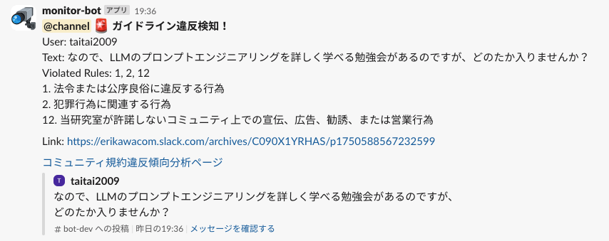
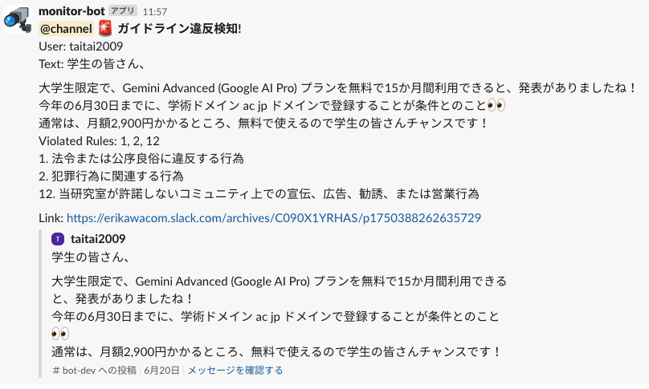
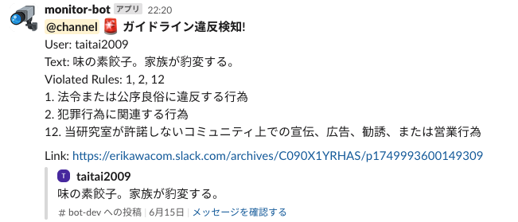
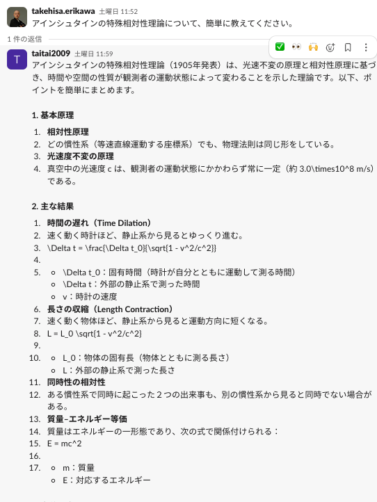
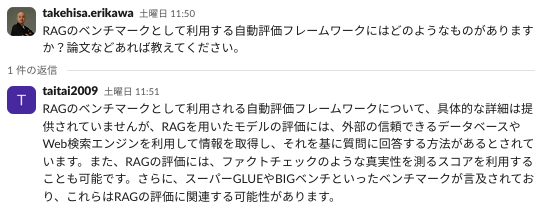
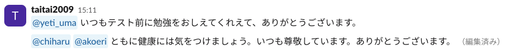
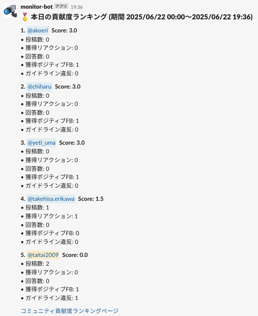
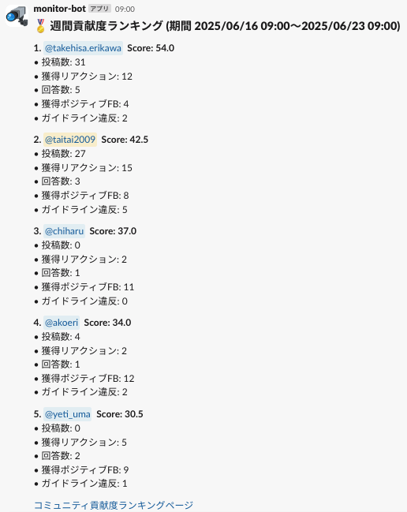
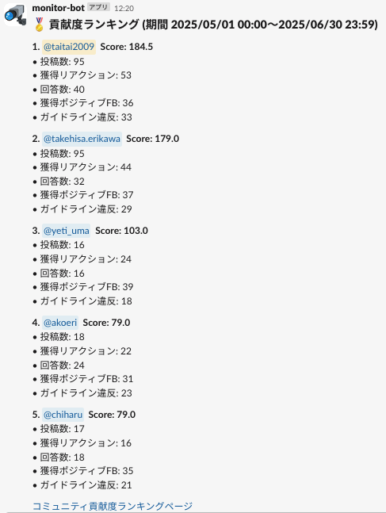
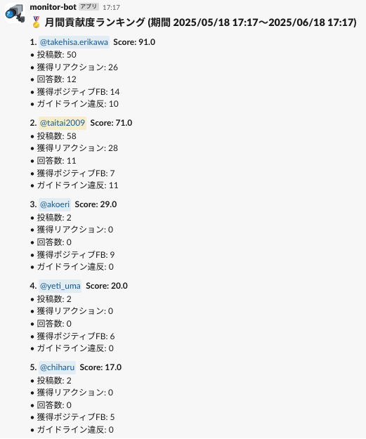

# PJT09 Slackの発言を監視するbot

`Code Name: pjt09-slack-monitor-bot`

このリポジトリは、松尾・岩澤研講義「AIエンジニアリング実践講座2025」の最終課題プロジェクト(PJT09)の成果物の一つであり、
以下課題解決のために設計・開発・実装・評価したBot アプリおよびスクリプト群です。

## 目次

- [PJT09 Slackの発言を監視するbot](#pjt09-slackの発言を監視するbot)
  - [目次](#目次)
  - [1. プロジェクト発注書抜粋](#1-プロジェクト発注書抜粋)
    - [解消したい課題](#解消したい課題)
    - [具体的に発注したいもの](#具体的に発注したいもの)
      - [(1) 具体的な機能(Slack内の投稿から次を自動で実現する)](#1-具体的な機能slack内の投稿から次を自動で実現する)
      - [(2) 速度や性能の要件があるか](#2-速度や性能の要件があるか)
      - [(3) 使用ツール例(特に指定はないが、以下を想定)](#3-使用ツール例特に指定はないが以下を想定)
      - [(4) この依頼の後に想定してほしいことがあるか](#4-この依頼の後に想定してほしいことがあるか)
      - [発展的な要件](#発展的な要件)
      - [留意点](#留意点)
    - [参考情報：松尾研のコミュニティ規約 第11条(禁止事項)](#参考情報松尾研のコミュニティ規約-第11条禁止事項)
  - [2. 要件定義・設計](#2-要件定義設計)
    - [2-1. 開発用に作成する Slack ワークスペース](#2-1-開発用に作成する-slack-ワークスペース)
    - [2-2. 開発用に作成した上記 Slack ワークスペースで以下を Bot で集計](#2-2-開発用に作成した上記-slack-ワークスペースで以下を-bot-で集計)
    - [2-3. Slack ワークスペース上での要件](#2-3-slack-ワークスペース上での要件)
    - [2-4. レポートの自動生成の要件](#2-4-レポートの自動生成の要件)
    - [2-5. データベース](#2-5-データベース)
    - [2-6. LLMの利用](#2-6-llmの利用)
    - [2-7. LLM APIプロバイダー比較](#2-7-llm-apiプロバイダー比較)
    - [2-8. LLM利用時のプロンプト設計](#2-8-llm利用時のプロンプト設計)
    - [2-9. プロダクトの性能・非機能要件の評価](#2-9-プロダクトの性能非機能要件の評価)
    - [2-10. プロジェクトの成功・失敗の定義](#2-10-プロジェクトの成功失敗の定義)
  - [3. 開発・実装](#3-開発実装)
    - [3-0. Bot アプリインストールの前提条件](#3-0-bot-アプリインストールの前提条件)
    - [3-1. Slack 側の準備](#3-1-slack-側の準備)
    - [3-2. Notion 側の準備](#3-2-notion-側の準備)
    - [3-3. Bot アプリのインストール](#3-3-bot-アプリのインストール)
    - [3-4. ファイル・ディレクトリ構成](#3-4-ファイルディレクトリ構成)
    - [3-5. 実行方法](#3-5-実行方法)
    - [3-6. トラブルシューティング例](#3-6-トラブルシューティング例)
    - [3-7. 全体構成概要 (Mermaid図)](#3-7-全体構成概要-mermaid図)
  - [4. プロダクトの検証](#4-プロダクトの検証)
    - [4-1. Slack コミュニティ規約検知と運営用チャネル`#bot-admin-dev`への即時通知](#4-1-slack-コミュニティ規約検知と運営用チャネルbot-admin-devへの即時通知)
    - [4-2. 質問に対して、有用な回答かのLLM判定(即時)](#4-2-質問に対して有用な回答かのllm判定即時)
    - [4-3. 他の受講生への感謝や称賛を示すポジティブフィードバックかのLLM判定(即時)](#4-3-他の受講生への感謝や称賛を示すポジティブフィードバックかのllm判定即時)
    - [4-4. 投稿に対して、ポジティブなリアクションがついたかのLLM判定(日次バッチ)](#4-4-投稿に対してポジティブなリアクションがついたかのllm判定日次バッチ)
    - [4-5. Slackでの`/scoreboard`コマンド](#4-5-slackでのscoreboardコマンド)
    - [4-6. Slack コミュニティ月間貢献者ランキングの受講者への紹介](#4-6-slack-コミュニティ月間貢献者ランキングの受講者への紹介)
    - [4-7. Notion - コミュニティ規約違反傾向分析ページ](#4-7-notion---コミュニティ規約違反傾向分析ページ)
    - [4-8. Notion - コミュニティ貢献度ランキングページ](#4-8-notion---コミュニティ貢献度ランキングページ)
  - [5. プロダクトの性能・非機能要件の評価結果](#5-プロダクトの性能非機能要件の評価結果)
    - [5.1. バッチ処理や各種コマンドの応答速度](#51-バッチ処理や各種コマンドの応答速度)
    - [5.2 日次レポートの自動生成処理の実行速度](#52-日次レポートの自動生成処理の実行速度)
    - [5.3 ログ監査・トレーサビリティの担保](#53-ログ監査トレーサビリティの担保)
    - [5.4. セキュリティ](#54-セキュリティ)
    - [5.5 LLMの性能計測](#55-llmの性能計測)
    - [5.6 LLM API利用のコスト試算](#56-llm-api利用のコスト試算)
  - [6. プロジェクトの評価](#6-プロジェクトの評価)
  - [7. 今後の展開](#7-今後の展開)
  - [脚注](#脚注)

[🔝 トップに戻る](#目次)

## 1. プロジェクト発注書抜粋

### 解消したい課題

- 現在、松尾・岩澤研究室ではデータサイエンスやAIに関する講義を多数開講しており、受講人数が多い講座だと11,000人といった規模の受講生がいます。
- 各講義ごとに準備をしているSlackを、受講生間での学び合いの場として活用しており、コミュニティを形成しています。コミュニティの活性化は修了率向上だけではなく、講座終了後もさらに学びを深めていただくために、重要度が高まっています。
- しかし現在、以下の課題があります。
  - すべてのコメントを目視でチェックするのが困難
  - ガイドライン違反投稿への対応が遅れるリスク
  - 貢献度の高い受講生を十分に評価できていない
- つまり、コミュニティの安心安全な運営と、貢献者への賞賛機会創出を支援する仕組みが必要です。

### 具体的に発注したいもの

#### (1) 具体的な機能(Slack内の投稿から次を自動で実現する)

- コミュニティガイドラインに違反している可能性がある発言を検出し、運営にアラート通知
- 他受講生へのポジティブフィードバック（例：感謝・称賛）を拾い上げる
- コミュニティ貢献度が高い受講生を自動的にスコア化・ランキング化する
- 投稿数、リアクション獲得数、回答貢献度、ポジティブ投稿数などを指標にスコアリング

#### (2) 速度や性能の要件があるか

- 1日に1回程度の更新・集計ができればよい
- 数百件の投稿があっても処理可能な設計
- LLM/API使用料など、運用コストの試算があると望ましい

#### (3) 使用ツール例(特に指定はないが、以下を想定)

- Slack API
- LLM（例：GPT-4o、Claude、Geminiなど）
- テキスト分類器（ガイドライン違反・ポジティブ検出用）
- データベース（貢献度スコアの保持）

#### (4) この依頼の後に想定してほしいことがあるか

- 受講生向けに「今月の貢献者紹介」機能などの展開
- 期間を通じて貢献度の高い受講生を表彰する機能

#### 発展的な要件

- Slackbotを通じて運営へリアルタイム通知できると理想的
- Notionや専用Webページに貢献者ランキングを自動反映できるようにする
- ガイドライン違反傾向や貢献傾向の分析レポートを自動生成し、講義運営に活用できる仕組みを目指す。

#### 留意点

- 実運用を目指すには、一度実装したきりでなく、運用の監視、継続的な改善などが必要となってきます。その点についても考慮した実装にしていただきたいです
- 実装方法についても、逐一詳細なドキュメントを書く必要はないですが、コードを始めてみる人が迷わないようにどこでどんなことをやっているのか、理解しやすいように書くことに留意してください

### 参考情報：[松尾研のコミュニティ規約 第11条(禁止事項)](https://weblab.freshdesk.com/support/solutions/articles/153000196368#第-11-条(禁止事項))

[🔝 トップに戻る](#目次)

---

## 2. 要件定義・設計

### 2-1. 開発用に作成する Slack ワークスペース

- 開発には個人利用の Slack ワークスペースを利用。以下のチャネルを新設。
- `#bot-dev` 雑談用チャネル --- 普段使いに使用。全員参加。
- `#bot-qa-dev` 質問・回答用チャネル --- 質疑応答に使う。全員参加。
- `#bot-admin-dev` 運営用チャネル --- 運営担当者限定チャネル

### 2-2. 開発用に作成した上記 Slack ワークスペースで以下を Bot で集計

- `post` 投稿数
- `reaction` 投稿についたポジティブなリアクション(スタンプ)の数(投稿主に加点、自身の投稿に自身でリアクションした時は除く)
- `answer` 質問に対して有用な回答(返信)の投稿数(回答者に加点、自身の投稿に自身で回答(返信)した時は除く)
- `positive_feedback`メンション付きで、感謝や称賛を含むポジティブなフィードバック投稿数(メンションされたユーザーに加点)
- `violation` 松尾・岩澤研のコミュニティガイドライン規約に違反している投稿、およびその数(投稿主から減点)
- `scores` 上記件数に重み付けをして足し合わせたものを、そのユーザーの「コミュニティ貢献度スコア」とする。重みは環境変数として変更可能とする。
- なお、上記件数の集計は、運営用チャネルでの投稿は対象外とする。
- `scores` を計算するための重みは、`utils/constants.py`で以下の通りデフォルト定義。変更可能。

    ```bash
    WEIGHTS = {
        'post': 1.0,
        'reaction': 0.5,
        'answer': 3.0,
        'positive_feedback': 3.0,
        'violation': -5.0,
    }
    ```

### 2-3. Slack ワークスペース上での要件

1. 松尾・岩澤研のコミュニティガイドライン規約に違反している投稿を検知した場合、運営用チャネルにてチャネル参加者全員宛に、違反があった旨、以下を即時通知する。
    - ユーザー名
    - 違反した投稿内容
    - 違反に該当したガイドラインの番号とそのガイドラインの内容
    - 投稿のURL
    - ガイドライン規約違反傾向分析ページ (Notion) のURL
2. Slack の運営者チャネルのみで利用可能なコマンド `/scoreboard <引数>` で、期間に合わせた`scores` の上位5名(環境変数で設定可能)のランキングを表示
   - 本日(引数: `today`)
   - 過去24時間(引数: `daily`)
   - １週間(引数: `weekly`)
   - 1ヶ月(引数: `monthly`)
   - 四半期(引数: `quarterly`)
   - 半期(引数: `semiannual`)
   - 年間(引数: `annual`)
   - 全期間累計(引数: `なし`)
3. 上記 `/scoreboard` は引数に、`/scoreboard YYYYMMDD-YYYYMMDD` と期間指定ができ、**任意の期間を通じて、貢献度の高い表彰対象の受講生の把握が可能**
4. 毎日0:00に運営者チャネルに、前日の貢献度ランキングの自動投稿
5. 毎月1日9:00に、雑談用チャネルに**先月の貢献度ランキングが自動投稿されランキング入りしたユーザーが紹介される。合わせて、ランキング入りしたユーザーはメンションされる。**
6. Slack の運営者チャネルのみで利用可能なコマンド `/apply_reactions` により、投稿へのリアクションで、これまでにポジティブと判定されていなかったものを、LLMを使い判定を行い、ポジティブと判定されれば加点を行う。(LLMの利用について後述)

### 2-4. レポートの自動生成の要件

- 以下のレポートの構築を、Slack と連携する Notion にて行う。Notion のレポートサイトは URL がわかれば誰もで閲覧可能とする。
  1. コミュニティガイドライン規約違反傾向分析ページ (毎日 0:00 の日次更新)
      - コミュニティガイドライン規約に違反した投稿の傾向のレポートとして、ガイドライン違反に該当した条項の番号(1つの投稿で複数該当するケースあり)について、過去7日間、30日間、全期間における以下の可視化を行う。
        - 違反に該当したガイドライン条項の番号をプロットしたヒストグラム
        - 各番号の増減の推移が時系列でわかる折れ線グラフ
        - 番号によらず、違反が何曜日のどの時間帯に起きているのかを示すヒートマップ
  
  2. コミュニティ貢献度ランキングページ
       - 貢献傾向の分析レポートとして、上記2で定義・収集した、スコア・件数について、本日、昨日、過去7日間、30日間、全期間において集計し、各期間ごとの貢献度スコアのランキング表を作成する。(期間毎の表示はビュー機能を利用)
       - 頻度: 本日のランキング更新は、毎時(HH:10)、それ以外のランキング更新は日次 0:00
       - 加えて、2で定義・収集した、スコア・件数について、過去7日間、30日間、全期間における以下の可視化を行う。(毎日 0:30 の日次更新)
         - 各スコア・件数の増減の推移が時系列でわかる折れ線グラフ
         - 各項目の加点が発生するのが、何曜日のどの時間帯に起きているのかを示すヒートマップ(貢献度スコア、ガイドライン違反を除く)

### 2-5. データベース

- 本プロジェクトではデータベースとして、構築が容易な SQLite3 を利用する。
- 上記2で定義したデータは、SQLite3 のスキーマ `events` に格納する。なお、`scores` は格納せず、必要な都度計算する。
- 
- 以下のLLMの利用にある、投稿へのリアクション(スタンプ)をLLMの判定対象にするかの情報を、SQLite3のスキーマ `reaction_judgement` に格納する。
- データベーススキーマは、`db_init.py` にて定義する。
- なお、本プロジェクトにおいては、投稿内容自体は、データベースには登録しないが、投稿のタイムスタンプ`TS`機能により、Slack APIにより照会が可能。

### 2-6. LLMの利用

- 前提: LLMはAPI経由で、以下のシーンで利用。なお、運営用チャネルでの投稿に対しては、LLMは利用しない。
  1. 投稿がコミュニティガイドラインに違反しているかの判定(即時)
  2. 投稿がメンションしたユーザーへの感謝・称賛などのポジティブなフィードバックを含んでいるか(即時)
  3. 質問・回答用チャネルにおける、質問への回答(返信に限る)が、適切な回答となっているかの判定(即時)
  4. 投稿へのリアクション(スタンプ)が、投稿主への感謝や賞賛・肯定的な意味を持つポジティブなものか判定(日次 0:10)
- 上記1, 2, 3については、キーワード判定だけでは難しいため、プロンプトを工夫することでLLMを利用することとした。(プロンプト設計について以下を参照)
- 上記4については、投稿に対するリアクションが集中すること(リアクションラッシュ)があるため、リアクションがある度に逐一即時LLM利用による判定には、API利用料に不安があった。
- 従って、あらかじめポジティブなリアクション(例: 👍 ❤️ 👏 🙇 🙏 ,etc.)は静的に定義しておき、左記に該当すれば即時加点し、該当しない場合は、リアクションを受けたことを記録しておき、日次バッチにより重複を排除する形で、ポジティブなリアクションかLLMに判定させることとする。
- 判定結果もデータベースに記録し、以降はリアクションが静的な定義に該当せず、以前にLLM判定されたかをデーターベースから確認できない場合のみ、日次バッチに回す運用とすることで、LLM利用の効率化を図る。
- なお、LLMにより一度ポジティブでないと判定されたリアクションを、ポジティブへの変更する場合は、手動でDBを操作する対応が必要。

### 2-7. LLM APIプロバイダー比較

- 以下の8つのポイントで、OpenAI、Google Gemini、Anthropic Claude を比較。総合評価より OpenAI の`gpt-3.5-turbo`または`o4-mini`を採用。
- ただし、将来の拡張を考慮し、次点の Google Gemini、Anthoropic Claude、AWS Bedrock なども使えるように、コードの拡張を検討する。

| 比較項目                       | OpenAI (GPT)                                                            | 評価 | Google Gemini[^1]                                                            | 評価 | Anthropic Claude[^2]                                                         | 評価 |
|--------------------------------|-------------------------------------------------------------------------|:----:|---------------------------------------------------------------------------|:----:|---------------------------------------------------------------------------|:----:|
| 1. モデル品質                  | GPT-4をはじめとする最先端モデルを提供。多言語対応・日本語性能も高く、生成品質は業界トップクラス。[^3] | ◯   | Gemini Ultraなど高性能モデルを提供。特に会話品質に強みがあり、Google検索との統合で最新情報にアクセス可能。 | ◯   | Claude 4など安全性重視の設計。生成品質は高いが、特定のタスクでGPTに一部劣るケースあり。 | △   |
| 2. APIの安定性・使いやすさ     | RESTベースのシンプルなエンドポイント、公式SDKが充実。サービス稼働率も高く、信頼性が実証済み。[^4]         | ◯   | Google Cloud上で提供、Cloud SDKやgRPC対応。Googleインフラの信頼性が強み。               | ◯   | 独自APIを提供。ドキュメントは整備されているが、SDKは限定的。API仕様変更の頻度は低い。   | △   |
| 3. ドキュメント・エコシステム   | 豊富なサンプルコードやチュートリアル、コミュニティサポートが充実。公式ブログ・論文も多数。[^5]            | ◯   | Google Cloudドキュメントと統合^。チュートリアルは多いが、LLM向け部分はまだ発展途上。    | △   | セキュリティ重視の設計ガイドを含むドキュメントが提供。コミュニティは小規模だが質の高い事例共有あり。 | △   |
| 4. 拡張性・将来性               | Fine-tuning, Function Calling, Embeddings等の周辺機能が豊富で、モデルアップデートも早期に提供。[^6]     | ◯   | Google Cloud AI製品群との連携やVertex AI統合でエコシステム拡張が容易。                | ◯   | 新機能追加を順次実施。安全性重視だが他社連携は限定的。長期ロードマップ公開。              | △   |
| 5. セキュリティ・コンプライアンス | SOC2/ISO27001取得済み。データ取り扱いポリシーが明確で、エンタープライズ利用に安心。[^7]                 | ◯   | Google Cloudのセキュリティ基盤を活用可能。VaultやIAMとの統合をサポート。           | ◯   | 社会的安全性重視。データは自社インフラ内で処理。                         | ◯   |
| 6. コスト透明性                | 従量課金モデルで初期投資不要。ダッシュボードで利用状況・コストを可視化可能。[^8]                        | ◯   | Cloud料金体系に準拠。複数サービスの組み合わせ料金を管理する必要がある。            | ◯   | 定額プラン中心。従量課金対応予定。可視化機能は限定的。                                    | △   |
| 7. コスト[^9]                   | gpt-3.5-turbo: $0.5/1M tokens, o4-mini: $1.1/1M input tokens                                   | ◯   | Gemini Pro: $1.25/1M input tokens                                             | △   | Claude Sonnet 4: $3.0/1M input tokens                                           | ×   |
| 8. 今回のタスクとの親和性        | コミュニティガイドライン違反判定・ポジティブフィードバック判定など、当プロジェクト固有タスクへの適合度が高い。[^10]     | ◯   | 実装自由度はあるが、初期プロンプト調整が必要。                                  | ◯   | 安全性重視のため調整は簡単だが、タスク特化チューニングは限定的。                        | △   |
| **総合評価**                   | **高い生成品質と安定性を備えたバランスの良い選択**                                          | **◯**    | 強力なインフラ連携と会話品質が魅力的                                            | △    | 安全性重視だが拡張性とコスト面で課題あり                                       | △    |

[^1]: https://cloud.google.com/vertex-ai/docs/generative-models/overview
[^2]: https://www.anthropic.com/products/claude
[^3]: https://platform.openai.com/docs/models/gpt-4
[^4]: https://platform.openai.com/docs/api-reference/introduction
[^5]: https://platform.openai.com/docs/
[^6]: https://platform.openai.com/docs/guides/fine-tuning
[^7]: https://openai.com/policies/security
[^8]: https://openai.com/pricing
[^9]: https://qiita.com/SH2/items/39314152c0a6f9a7b681
[^10]: https://platform.openai.com/docs/guides/prompts

### 2-8. LLM利用時のプロンプト設計

以下のLLM利用シーンにおいては、それぞれ以下のようにプロンプトを設計し、出力をYes/Noなどとすることにより、output token 数を極力減らすこととする。

1. 投稿がコミュニティガイドラインに違反しているかの判定(即時) --- `classfier.py`で定義
    - システムプロンプト：
      - あなたは研究室のSlackコミュニティ運営ボットです。以下はコミュニティ規約(番号付き)です。全文をよく読み、投稿が規約違反かどうか、かつ、違反なら何番に違反しているかを番号で答えてください。
      - `コミュニティ規約第11条`を列記
    - ユーザープロンプト：
      - 次の投稿について:
      - `投稿文`
      - 1 違反していますか？Yes/No
      - 2 違反なら、違反した規約番号をカンマ区切りで教えてください。違反がない場合は、番号は一切返さないでください。"

2. 投稿がメンションしたユーザーへの感謝・称賛などのポジティブなフィードバックを含んでいるか(即時) --- `classfier.py`で定義
    - システムプロンプト：
       - あなたはSlackコミュニティ運営ボットです。
    - ユーザープロンプト：
       - 以下の投稿が他ユーザーへの「感謝」や「称賛」などの、ポジティブなフィードバックを含んでいるか？
       - 投稿:`投稿文`
       - 含んでいる場合はメンションされたユーザーIDをJSONリストで、含んでいない場合は空リスト([])で答えてください。

3. 質問・回答用チャネルにおける、質問への回答(返信に限る)が、適切な回答となっているかの判定(即時) --- `classfier.py`で定義
    - システムプロンプト：
      - あなたはSlackのQAコミュニティ運営ボットです。
    - ユーザープロンプト： 
      - 以下は質問です：
      - `質問文`
      - 以下はその返信です：
      - `回答文`
      - この返信は質問に対する適切な回答か？Yes/No で答えてください。

4. 投稿へのリアクション(スタンプ)が、投稿主への感謝や賞賛・肯定的な意味を持つポジティブなものか判定(日次 0:10) --- `llm_judge.py`で定義
    - システムプロンプト：
      - あなたはSlackコミュニティの管理AIです。
    - ユーザープロンプト：
      - Slackのリアクションで`リアクション名`は、他者への感謝や賞賛・肯定的な意味を持つポジティブなものですか？
      - 必ず 'yes' か 'no' のどちらか1単語のみで答えてください。理由や補足は一切書かないでください。

### 2-9. プロダクトの性能・非機能要件の評価

- プロジェクト完了時に、以下について評価する
  - バッチ処理や各種コマンドの応答速度
  - 日次レポートの自動生成処理の実行速度
  - ログ監査・トレーサビリティの担保
  - セキュリティ
  - LLMの性能計測
    - 既存定義済みポジティブリアクション（例: +1, heart_eyes, raised_handsなど）について、LLMによる自動判定結果と静的定義との一致率を計測
    - サンプル質問や感謝メッセージなどの「教師データ」で、ガイドライン違反やポジティブフィードバック判定の精度（正解率・誤検知率）を評価
    - LLM APIコール数、コスト試算

### 2-10. プロジェクトの成功・失敗の定義

- **成功条件**
  - LLMによる自動評価と自身による定性的な評価の一致率が高い。
  - Slack上で「/scoreboard」「/apply_reactions」などのコマンドで運営担当者がスコアを確認・管理できる。
  - 日次・週次などで正しいランキングやレポートが自動生成される。
- **失敗条件**
  - LLM判定が意図から大きくズレている（例：明らかな誤判定）
  - パフォーマンスやコストなど、運用に耐えない場合

[🔝 トップに戻る](#目次)

---

## 3. 開発・実装

### 3-0. Bot アプリインストールの前提条件

- Python 3.9以上がインストールされていること(Ubuntu 24.4LTS, Python 3.12.3 で動作確認済)
- `pip install -r requirements.txt` で依存ライブラリをインストール
- `.env` ファイルに必要な環境変数を設定
- Notion は API を利用して画像ファイルのアップロードができないため、インターネットに公開できるWebサイトへ画像ファイルをアップロードして、その URL を Notion のページに埋め込んでいる。埋め込む URL については、ホスティングサイトや AWS S3 などにアップロードされた画像の URL の末尾が、画像ファイル(PNG, JPGなど)を示していることが必要。
- Google Drive は画像ファイルをアップロードすると、URL から拡張子がなくなってしまうため、非対応。
- 今回の実装では、個人で利用するWebサイトサービスを利用した。
- 当該Webサイトサービスへは、公開鍵を利用してパスワードレスで、SCP/SSHを利用し、画像ファイルの転送をできるようにした。

### 3-1. Slack 側の準備

1. **Slack App 作成**  
   - [Slack API Apps 管理ページ](https://api.slack.com/apps) にアクセスする。
   - 右上の「Create New App」からAppを新規(From Scratch)に作成。
   - 適宜Appに名前をつけ(例: monitor-bot)、監視するワークスペースを選択する。
   - 左のメニュー Basic Information → App-Level Tokens、Generate Token and Scopesを押下。
   - 適宜Token Nameをつけ(例: my-app-token)、Scopeを「connections:write」に設定し、Tokenを発行。Copyして 環境変数の `SLACK_APP_TOKEN` に設定。
   - 左メニュー OAuth & Permissions → Scopes、Bot Token Scopes で、Add an OAuth Scopeを押下し、以下を追加。
     - app_mentioned:read
     - channels:read, channels:history
     - chat:write
     - commands
     - groups:history, groups:read
     - reactions:read
     - users:read
   - 同じページにある OAuth Tokens にある、「Install App to <Workspace名>」を押下して、Appをインストール。
   - その時に現れる、Bot User OAuth Token を Copyして環境変数の `SLACK_BOT_TOKEN` に設定。
   - 左メニュー Install App でも同じことができる。上記Scopeを変更する際は、Install App　からAppをReinstallしてもよい。

2. **Socket Mode 有効化**
   - 左メニュー Socket Mode から Enable Socket Mode を有効化。以下の Features affected になる。
     - Interactivity & Shortcuts
     - Slash Commands
     - Event Subscriptions
   - 新たに、Socket Modeの設定を変更をした場合は、App の Reinstall が必要

3. **Slash コマンド登録**  
   - Slack API Apps 管理ページで左メニューの「Slash Commands」を選択。
   - 「Create New Command」をクリックし、
     - Command: `/scoreboard`
     - Short Description: (例えば) `貢献度ランキングを表示`
     - Usage Hint: (なくてもよい)
   - 同様に未判定リアクションの LLM 判定＋スコア反映するための `/apply_reactions` を追加。
   - 新たに、Slash コマンドを追加や変更をした場合は、App の Reinstall が必要

4. **Event Subscriptions の設定**  
   - Slack API Apps 管理ページで左メニューの「Event Subscriptions」を選択。
   - 「Enable Events」を On にし、Request URL に `https://<your workspace name>/slack/events` を設定。ただし、Socket Mode が有効化されているとURLの入力は不要。
   - 「Subscribe to Bot Events」セクションで以下を追加:
     - app_mention
     - message.channels
     - message.groups
     - reaction_added
     - reaction_removed
   - 新たに、Event Subscriptionを設定変更した場合は、App の Reinstall が必要

### 3-2. Notion 側の準備

1. **Notion API インテグレーション作成**
   - Notion の [My integrations](https://www.notion.so/my-integrations) から新規インテグレーションを作成。
   - 「Internal Integration」タイプを選択し、適切な名前を設定。
   - 作成後、「Internal Integration Token」をコピーし、環境変数 `NOTION_TOKEN` に設定。

2. **対象ページ・データベースを共有**
   - Bot が書き込む Notion ページおよびデータベースの右上「Share」メニューから、先ほど作成したインテグレーションを招待。
   - 編集権限（Can edit）を付与することで、ページ内のブロック操作やデータベースのクエリ・アップデートが可能になる。

3. **ページID・データベースID の取得**
   - 今回は、以下のページを作成
     - 貢献度スコア算出のための各種件数を格納する、「コミュニティ貢献度スコアデータベース」
     - 上記データベースを埋め込み、データを可視化したグラフのURLを埋め込む、「コミュニティ貢献度スコアランキング」ページ
     - コミュニティ規約違反傾向を分析するためのデータを可視化したグラフURLを埋め込む、「コミュニティ規約違反傾向分析」ページ
   - 上記 Notion の３つページの URL からページIDを取得し、環境変数として、それぞれ `NOTION_DB_ID`、`NOTION_PAGE_ID`、`NOTION_VIOLATION_PAGE_ID` を設定。

4. **閲覧権限について**
   - 公開リンクを有効化すれば、URLを知っているユーザーは誰でもページを閲覧可能。
   - 編集は、インテグレーションに招待されたユーザーと Bot のみが可能。

### 3-3. Bot アプリのインストール

1. リポジトリをクローン:

   ```bash
   git clone https://github.com/taitai-2009/pjt09-slack-monitor-bot.git
   cd pjt09-slack-monitor-bot
   ```

2. 仮想環境の作成・有効化:

   ```bash
   python3 -m venv venv
   source ./venv/bin/activate
   ```

3. 依存パッケージのインストール:

   ```bash
   pip install -r requirements.txt
   ```

4. `.env` ファイルをコピーして編集:

   ```bash
   cp .env.example .env
   # 必要な値を設定
   ```

### 3-4. ファイル・ディレクトリ構成

- 典型的な構成:

  ```bash
  pjt09-slack-monitor-bot/
  ├── app.py                    ← Bot アプリ本体
  ├── publish_master_upsert.py  ← DB更新スクリプト(*)
  ├── publish_user_metrics.py   ← 貢献度可視化画像の作成、アップロード、Notion への埋め込み(*)
  ├── violation_trends.py       ← ガイドライン違反状況可視化画像の作成、アップロード、Notion　への埋め込み(*)
  ├── requirements.txt          ← Python依存パッケージ一覧
  ├── .env                      ← 環境設定ファイル
  ├── utils/
  │   ├── classifier.py         ← キーワード・LLMによる投稿のポジティブ／違反判定ロジック
  │   ├── constants.py          ← 貢献度計算用の重み設定
  │   ├── db.py                 ← SQLite3 DB照会・更新のラッパー
  │   ├── guidelines.txt        ← LLM API のプロンプトに組み込むコミュニティ規約一覧
  │   ├── llm_judge.py          ← LLM API を用いたリアクション判定の処理
  │   ├── scoring.py            ← 投稿数・リアクション数などから貢献度スコアを計算するロジック
  │   └── slack_helpers.py      ← Slack API 呼び出しによるユーザー名やチャネル名解決ユーティリティ、
  │                               キャッシュ機能もあり、Slack APIのレートリミットを考慮)
  └── metrics_outputs/          ← 画像を一時格納するディレクトリ

  (*) 単体での実行も可能
  ```

### 3-5. 実行方法

- 開発モードで起動:

  ```bash
  source ./venv/bin/activate
  python3 app.py
  ```

- systemd や docker-compose 等で常駐実行することを推奨
- ユーザーメトリクス(本日)の手動更新

  ```bash
  source ./venv/bin/activate
  python3 publish_master_upsert.py
  ```

- ユーザーメトリクス(本日以外)、および、貢献度ランキングページの手動更新

  ```bash
  source ./venv/bin/activate
  python3 publish_user_metrics.py
  ```

- コミュニティガイドライン違反件数、および、コミュニティガイドライン違反傾向分析ページの手動更新

  ```bash
  source ./venv/bin/activate
  python3 violation_trends.py
  ```

### 3-6. トラブルシューティング例

- Slackイベントが受信できない場合:
  - API管理メニューの OAuth & Permissions → Scopes、Bot Token Scopes に必要な権限が登録されているか確認
  - Subscribe to Bot Events に必要な Events が登録されているか確認
- Notion操作で権限エラーが出る場合:
  - インテグレーションにページ・DBが共有されているか確認

### 3-7. 全体構成概要 (Mermaid図)

```mermaid
flowchart TD
  subgraph "Slack Workspace"
    A["ユーザー投稿 / リアクション"]
    B["/scoreboard, /apply_reactions コマンド"]
  end

  subgraph "Bot App (app.py)"
    direction TB
    A -->|Events API／Socket Mode| C["app.py リスナー"]
    B -->|Slash Command| C
    C --> D["SQLite3 (eventsテーブル等)"]
    C --> E["LLM 判定<br>(gpt-3.5-turbo／o4-mini)"]
  end

  subgraph "Scheduler"
    F["publish_master_upsert.py<br>ランキング更新"]
    G["publish_user_metrics.py<br>貢献度レポート"]
    H["violation_trends.py<br>違反傾向分析"]
    D --> F
    D --> G
    D --> H
  end

  subgraph "Storage"
    I["画像Webホスティング<br>AWS S3など"]
    G --> I
    H --> I
  end

  subgraph "Notion"
    J["Integration Token"]
    F -->|DB Upsert| K["貢献度ランキングDB"]
    G -->|Embed Plot URLs| L["ランキングページ"]
    H -->|Embed Plot URLs| M["違反分析ページ"]
    K & L & M -->|PATCH/POST API| J
  end
  ```

- **Slack Workspace**：ユーザー投稿やSlashコマンドをBotに送信  
- **Bot App**：`app.py`がイベントを受信し、DB格納やLLMによる即時判定を実行  
- **Scheduler**：定期的に各スクリプトを走らせ、DBから集計・グラフ生成・Notion更新  
- **Storage**：生成したプロット画像をホスティングサービスへアップロード  
- **Notion**：Integration Tokenで認証し、データベースへのUpsertやページへの埋め込み  

[🔝 トップに戻る](#目次)
  
---

## 4. プロダクトの検証

### 4-1. Slack コミュニティ規約検知と運営用チャネル`#bot-admin-dev`への即時通知

1. 想定通り、ガイドライン番号 1(法令違反), 2(犯罪行為), 10(ユーザーへの損害等) に該当した事例。
  

2. 想定通り、ガイドライン番号 12 の勧誘や営業行為に該当した事例。一方で、1や２の法令違反、犯罪行為にもヒットしている。プロンプトの改善の余地があるかも。
  

    - 上記通知を受けるまでのログメッセージ

      ```bash
      2025-06-22 19:36:08 INFO [LLM: o4-mini] classify_text req: 'なので、LLMのプロンプトエンジニアリングを詳しく学べる勉強会があるのですが、どのたか入りませんか？'
        → Bot が投稿を受領し、LLM による判定を開始
      2025-06-22 19:36:11 INFO HTTP Request: POST https://api.openai.com/v1/chat/completions "HTTP/1.1 200 OK"
        → LLMへのAPI通信の成功
      2025-06-22 19:36:11 INFO [LLM: o4-mini] classify_text resp: '1) Yes
      2) 12'
        → LLMからの判定結果の受領 (ここまで約3秒)
      2025-06-22 19:36:11 INFO message classify_text in #bot-dev by @taitai2009 (ts=1750588567.232599): 'なので、LLMのプロンプトエンジニアリングを詳しく学べる勉強会があるのですが、どのたか入りませんか？' -> {'violation': True, 'rules': [1, 2, 12]}
      2025-06-22 19:36:11 INFO DB INSERT: user_id=U09126FTFGD, reactor_id=None, type=violation, reaction_name=None, ts_epoch=1750588567.232599
        → 該当のメッセージは、コミュニティ規約1, 2, 12に違反した旨DBに記録
      2025-06-22 19:36:12 INFO notification sent: violation user=@taitai2009 channel=#bot-dev ts=1750588567.232599 rules=[1,2,12]
        → 運営用チャネルに、コミュニティ規約違反した旨通知 (ここまで約4秒)
      ```

3. Google AI Pro の学生向けキャンペーンの初回が、ガイドライン番号 12 の宣伝、勧誘に該当してしまった事例（想定外）。上記同様1, 2にもヒットしている。
&nbsp;  
&nbsp;  
  

1. 想定外の動作。TV CMと同じセリフを投稿したら、ガイドライン違反にヒットしてしまった事例。
  

1. **考察**
    - 犯罪や勧誘、ユーザーが不快に感じる投稿を複数回したが、**概ね検知されることを確認。**
    - **投稿、LLMによる判定、通知までは、約4〜5秒程度であり、実用の範囲。**
    - 一方で、ほとんどのケースで、ガイドラインの1(法令違反), 2(犯罪行為)にヒットしたり、必ずしも勧誘には当たらないもの(上記３)や、まれに全然関係のないものもガイドライン違反としてヒットすることがあり、**プロンプトに改善の余地、または別のLLMの利用による改善があると思われる。**
    - 上記のような判定が曖昧なものや、間違ったものに関しては、運営側で人手での判断が必要と思料。(**Human in the loop.**)

### 4-2. 質問に対して、有用な回答かのLLM判定(即時)

1. 有用な回答として判定されたケース
&nbsp;  
&nbsp;  
  

    - 上記判定に至るまでのログメッセージ

      ```bash
        2025-06-21 11:52:54 INFO [LLM: o4-mini] classify_text req: 'アインシュタインの特殊相対性理論について、簡単に教えてください。'
          → 質問の受領と同時に、コミュニティ規約違反か判定が始まる。
        2025-06-21 11:52:57 INFO HTTP Request: POST https://api.openai.com/v1/chat/completions "HTTP/1.1 200 OK"
        2025-06-21 11:52:57 INFO [LLM: o4-mini] classify_text resp: '1) No'
        2025-06-21 11:52:57 INFO message classify_text in #bot-qa-dev by @takehisa.erikawa (ts=1750474373.646699): 'アインシュタインの特殊相対性理論について、簡単に教えてください。' -> {'violation': False, 'rules': []}
          → 質問の内容は、コミュニティ規約違反なし。
        2025-06-21 11:52:57 INFO DB INSERT: user_id=U02NEQGC2B1, reactor_id=None, type=post, reaction_name=None, ts_epoch=1750474373.646699
        2025-06-21 11:52:57 INFO score updated: user=@takehisa.erikawa field=post channel=#bot-qa-dev ts=1750474373.646699
        2025-06-21 11:59:27 INFO [LLM: o4-mini] classify_text req: 'アインシュタインの特殊相対性理論（1905年発表）は、光速不変の原理と相対性原理に基づき、時間や空間の性質が観測者の運動状態によって変わることを示した理論です。'
          → 回答を受領と同時に、コミュニティ規約違反か判定が始まる。
        2025-06-21 11:59:29 INFO HTTP Request: POST https://api.openai.com/v1/chat/completions "HTTP/1.1 200 OK"
        2025-06-21 11:59:29 INFO [LLM: o4-mini] classify_text resp: '1) No'
        2025-06-21 11:59:29 INFO message classify_text in #bot-qa-dev by @taitai2009 (ts=1750474765.590899) (thread reply): 'アインシュタインの特殊相対性理論（1905年発表）は、光速不変の原理と相対性原理に基づき、時間や空間の性質が観測者の運動状態によって変わることを示した理論です。以下、ポイントを簡単にまとめます。
        *1. 基本原理*
        1. *相対性原理*
        2. どの慣性系（等速直線運動する座標系）でも、物理法則は同じ形をしている。
        3. *光速度不変の原理*
        :
        特殊相対性理論は「光速がどの慣性系でも一定」という一見シンプルな仮定から、時間や空間の直感を覆す驚くべき結果を導き出した、20世紀物理学の大きな柱の一つです。ご参考になれば幸いです。' -> {'violation': False, 'rules': []}
          → 回答の内容は、コミュニティ規約違反なし。(回答受領から約1秒以内)
        2025-06-21 11:59:29 INFO thread reply in #bot-qa-dev by @taitai2009 (ts=1750474765.590899), parent_author=U02NEQGC2B1
        2025-06-21 11:59:29 INFO [LLM: o4-mini] is_likely_answer req: question='アインシュタインの特殊相対性理論について、簡単に教えてください。', answer='アインシュタインの特殊相対性理論（1905年発表）は、光速不変の原理と相対性原理に基づき、時間や空間の性質が観測者の運動状態によって変わることを示した理論です。'
          → 質問への回答(返信)のなので、適切な回答か LLM による判定が始める。
        2025-06-21 11:59:31 INFO HTTP Request: POST https://api.openai.com/v1/chat/completions "HTTP/1.1 200 OK"
        2025-06-21 11:59:31 INFO [LLM: o4-mini] is_likely_answer resp: 'yes'
          → LLM による判定は、yes で、適切な回答と判定される。(回答受領から約2秒)
        2025-06-21 11:59:31 INFO score updated: user=@taitai2009 field=answer channel=#bot-qa-dev ts=1750474765.590899
      ```

2. 有用な回答として判定されなかったケース (全ての質問に答えていない？)
&nbsp;  
&nbsp;  
  

1. **考察**
    - 質疑応答専用チャネル`bot-qa-dev`にて、質問と回答を複数回実施したが、四則演算などの単純な質問で、回答が正確であれば、**ほぼ有用な回答として判定されることを確認。**
    - 質問が複雑な場合、質問が複数の質問に分かれており、全てに回答していない場合は、有用な回答と判定しされないケースあり。
    - 上記のような事象が起こるに対しては、**プロンプトの改善、または別のLLMの利用による改善が必要と思料。**
    - 一方で、**質問受領、LLMによる判定までは、約2秒程度であり、実用の範囲。**

### 4-3. 他の受講生への感謝や称賛を示すポジティブフィードバックかのLLM判定(即時)

1. メンション付きで、他の受講生への感謝や称賛を示すポジティブフィードバックの投稿の例
 

2. LLMによりポジティブ判定されたケース

    ```bash
    2025-06-23 15:11:11 INFO [LLM: o4-mini] classify_text req: '<@U09196GMFSP> いつもテスト前に勉強をおしえてくれえて、ありがとうございます。'
      → まずは、コミュニティ規約違反かどうか判定開始。
    2025-06-23 15:11:14 INFO HTTP Request: POST https://api.openai.com/v1/chat/completions "HTTP/1.1 200 OK"
    2025-06-23 15:11:14 INFO [LLM: o4-mini] classify_text resp: '1) No'
      → コミュニティ規約違反ではない。
    2025-06-23 15:11:14 INFO [LLM: o4-mini] detect_positive_feedback req: '<@U09196GMFSP> いつもテスト前に勉強をおしえてくれえて、ありがとうございます。'
      → ポジティブフィードバックか判定を開始。
    2025-06-23 15:11:16 INFO HTTP Request: POST https://api.openai.com/v1/chat/completions "HTTP/1.1 200 OK"
    2025-06-23 15:11:16 INFO [LLM: o4-mini] detect_positive_feedback resp: '["U09196GMFSP"]'
    2025-06-23 15:11:16 INFO positive feedback detected in #bot-dev: targets=['yeti_uma'] text='@yeti_uma いつもテスト前に勉強をおしえてくれえて、ありがとうございます。'
      → ポジティブフィードバックとして判定。
    2025-06-23 15:11:16 INFO DB INSERT: user_id=U09196GMFSP, reactor_id=None, type=positive_feedback, reaction_name=None, ts_epoch=1750659070.373359
    2025-06-23 15:11:16 INFO score updated: user=@yeti_uma field=positive_feedback channel=#bot-dev ts=1750659070.373359
    ```

3. 当初ポジティブ判定されなかったが、投稿の編集により、ポジティブとなったケース。

    ```bash
    2025-06-23 15:11:46 INFO [LLM: o4-mini] classify_text req: '<@U09197M2GUW> <@U091UDSFGQ0> ともに健康には気をつけましょう。尊敬しています。'
      → まずは、コミュニティ規約違反かどうか判定開始。
    2025-06-23 15:11:49 INFO HTTP Request: POST https://api.openai.com/v1/chat/completions "HTTP/1.1 200 OK"
    2025-06-23 15:11:49 INFO [LLM: o4-mini] classify_text resp: '1) No
    Jun 23 15:11:49 kabul python3[3831977]: 2)'
      → コミュニティ規約違反ではない。
    2025-06-23 15:11:49 INFO message classify_text in #bot-dev by @taitai2009 (ts=1750659105.451679): '@chiharu @akoeri ともに健康には気をつけましょう。尊敬しています。' -> {'violation': False, 'rules': []}
    2025-06-23 15:11:49 INFO DB INSERT: user_id=U09126FTFGD, reactor_id=None, type=post, reaction_name=None, ts_epoch=1750659105.451679
    2025-06-23 15:11:49 INFO score updated: user=@taitai2009 field=post channel=#bot-dev ts=1750659105.451679
      → ポジティブフィードバックにはならず、通常の投稿 (type=post) として処理
    2025-06-23 15:12:38 INFO DB INSERT: user_id=U09126FTFGD, reactor_id=None, type=post, reaction_name=None, ts_epoch=1750659158.4077733
    2025-06-23 15:12:38 INFO score updated: user=@taitai2009 field=post channel=#bot-dev ts=None
    2025-06-23 15:13:00 INFO [LLM: o4-mini] classify_text req: '<@U09197M2GUW> <@U091UDSFGQ0> ともに健康には気をつけましょう。いつも尊敬しています。ありがとうございます。'
      → 投稿を編集し、最後に「ありがとうございます。」を追記。コミュニティ規約違反か判定開始。
    2025-06-23 15:13:02 INFO HTTP Request: POST https://api.openai.com/v1/chat/completions "HTTP/1.1 200 OK"
    2025-06-23 15:13:02 INFO [LLM: o4-mini] classify_text resp: '1) No'
      → コミュニティ規約違反ではない。
    2025-06-23 15:13:02 INFO [LLM: o4-mini] detect_positive_feedback req: '<@U09197M2GUW> <@U091UDSFGQ0> ともに健康には気をつけましょう。いつも尊敬しています。ありがとうございます。'
      → ポジティブフィードバックか判定開始。
    2025-06-23 15:13:06 INFO HTTP Request: POST https://api.openai.com/v1/chat/completions "HTTP/1.1 200 OK"
    2025-06-23 15:13:06 INFO [LLM: o4-mini] detect_positive_feedback resp: '["U09197M2GUW", "U091UDSFGQ0"]'
    2025-06-23 15:13:06 INFO positive feedback detected in #bot-dev: targets=['akoeri', 'chiharu'] text='@chiharu @akoeri ともに健康には気をつけましょう。いつも尊敬しています。ありがとうございます。'
      → ポジティブフィードバックとして判定。
    2025-06-23 15:13:06 INFO DB INSERT: user_id=U091UDSFGQ0, reactor_id=None, type=positive_feedback, reaction_name=None, ts_epoch=1750659186.3204567
    2025-06-23 15:13:06 INFO score updated: user=@akoeri field=positive_feedback channel=#bot-dev ts=None
    ```

4. **考察**
    - メンション付き投稿に対して、メンションされた受講者への感謝や称賛を示すポジティブフィードバックかどうかをLLMにて判定させたもの。
    - 感謝をしめす、ありがとう。助かりました。などのキーワードが入っていると、ポジティブフィードバックとしてカウントされやすいことがわかった。
    - フィードバック投稿を行う前の投稿との関係を見ると、より良い判定ができるかもしれない。**プロンプトの改善、または別のLLMの利用による改善が必要と思料。**
    - 一方で、**メンション付き投稿を受領、LLMによるガイドライン違反判定から、ポジティブフィードバックまでは、約1〜6秒程度であり、そもそも受講者はポジティブなフィードバックと判定されたか認識できないので、実用の範囲。**

### 4-4. 投稿に対して、ポジティブなリアクションがついたかのLLM判定(日次バッチ)

1. LLM判定時のログメッセージ

    ```bash
      2025-06-22 00:10:00 INFO Running job "apply_all_positive_reactions (trigger: cron[hour='0', minute='10'], next run at: 2025-06-23 00:10:00 JST)" (scheduled at 2025-06-22 00:10:00+09:00)
        → 日次 0:10 のバッチジョブ開始。
      2025-06-22 00:10:00 INFO [LLM-batch: o4-mini] unjudged reactions = ['slack', 'camping', 'handshake', 'smiling_face_with_3_hearts']
        → 4つのリアクション(スタンプ)の判定を開始
      2025-06-22 00:10:00 INFO [LLM: o4-mini] judge_positive_reaction req: ':slack:'
        → :slack: の判定を開始
      2025-06-22 00:10:03 INFO HTTP Request: POST https://api.openai.com/v1/chat/completions "HTTP/1.1 200 OK"
      2025-06-22 00:10:03 INFO [LLM: o4-mini] judge_positive_reaction resp for ':slack:': 'no'
      2025-06-22 00:10:03 INFO [LLM-batch: o4-mini] slack: not positive
        → :slack: の判定は、ポジティブではない。
      2025-06-22 00:10:03 INFO [LLM: o4-mini] judge_positive_reaction req: ':camping:'
        → :camping: の判定を開始
      2025-06-22 00:10:05 INFO HTTP Request: POST https://api.openai.com/v1/chat/completions "HTTP/1.1 200 OK"
      2025-06-22 00:10:05 INFO [LLM: o4-mini] judge_positive_reaction resp for ':camping:': 'no'
      2025-06-22 00:10:05 INFO [LLM-batch: o4-mini] camping: not positive
        → :camping: の判定は、ポジティブではない。
      2025-06-22 00:10:05 INFO [LLM: o4-mini] judge_positive_reaction req: ':handshake:'
        → :handshake: の判定を開始
      2025-06-22 00:10:08 INFO HTTP Request: POST https://api.openai.com/v1/chat/completions "HTTP/1.1 200 OK"
      2025-06-22 00:10:08 INFO [LLM: o4-mini] judge_positive_reaction resp for ':handshake:': 'yes'
      2025-06-22 00:10:08 INFO [LLM-batch: o4-mini] handshake: POSITIVE
        → :handshake: の判定は、ポジティブ。
      2025-06-22 00:10:08 INFO [LLM: o4-mini] judge_positive_reaction req: ':smiling_face_with_3_hearts:'
        → :smiling_face_with_3_hearts: の判定を開始
      2025-06-22 00:10:10 INFO HTTP Request: POST https://api.openai.com/v1/chat/completions "HTTP/1.1 200 OK"
      2025-06-22 00:10:10 INFO [LLM: o4-mini] judge_positive_reaction resp for ':smiling_face_with_3_hearts:': 'yes'
        → :smiling_face_with_3_hearts: の判定は、ポジティブ。
      2025-06-22 00:10:10 INFO [LLM-batch: o4-mini] smiling_face_with_3_hearts: POSITIVE
      2025-06-22 00:10:10 INFO [LLM-batch: o4-mini] found 47 unscored positive reactions
      2025-06-22 00:10:10 INFO [LLM-batch: o4-mini] done: 47 reactions scored
      2025-06-22 00:10:10 INFO [LLM-batch: o4-mini] Positive reactions judged by LLM:
        taitai2009: handshake, heart_eyes, thumbsup, +1, thumbsup, heart_eyes, heart_eyes, heart_eyes, heart_eyes, heart_eyes, +1, smiling_face_with_3_hearts
        chiharu: heart_eyes, heart_eyes, heart_eyes, pray, heart_eyes, +1, pray
        akoeri: pray, thumbsup, heart_eyes, thumbsup, pray, pray, heart_eyes, pray
        yeti_uma: pray, heart_eyes, pray, thumbsup, +1, +1, heart_eyes, +1, +1, +1, pray, heart_eyes
        takehisa.erikawa: +1, +1, heart_eyes, +1, heart_eyes, heart_eyes, thumbsup, +1
          → これまでに、LLMによる判定がなかったリアクションに、判定結果が加わった。
      2025-06-22 00:10:10 INFO Job "apply_all_positive_reactions (trigger: cron[hour='0', minute='10'], next run at: 2025-06-23 00:10:00 JST)" executed successfully
    ```

2. **考察**
    - あらかじめ定義したポジティブなリアクション(スタンプ)に該当せず、これまでLLMによる判定も行われいないリアクション(スタンプ)については、日次で、重複を省いた形で、LLMによる判定を行い、ポジティブと判定された場合は加点を実施。
    - 上記の例は4つの、LLMみ判定のリアクションを判定したもの。4つのリアクションに対して約10秒で判定が完了 (**約2.5秒/リアクション**) しており、**深夜のバッチジョブであれば、許容できる**もの。

### 4-5. Slackでの`/scoreboard`コマンド

1. 本日のコミュニティ貢献者の確認`/scoreboard today`
&nbsp;  
&nbsp;  


2. 週間コミュニティ貢献者の確認`/scoreboard weekly`
&nbsp;  
&nbsp;  


3. 任意の期間のコミュニティ貢献者の確認`/scoreboard 20250501-20250630`
&nbsp;  
&nbsp;  


4. **考察**
    - `/scoreboard`コマンドにより、コミュニティ運営側で、当日、過去24時間、過去１週間、過去１ヶ月、過去３ヶ月、過去半年、過去1年、全期間の、貢献度スコア上位N位 (Nのデフォルトは、5。環境変数で変更可能) のスコア、投稿数、獲得リアクション数、有用な回答数、獲得ポジティブフィードバック数、ガイドライン違反数の確認が可能。
    - LLM APIは利用しないため、**実行は即時であり、実用の範囲**。
    - また、**任意の期間を通じてコミュニティ貢献度の高い受講生を確認する機能も実装`/scoreboard YYYYMMDD-YYYYMMDD`し、該当の受講生の表彰につなげらる**ものと思料。

### 4-6. Slack コミュニティ月間貢献者ランキングの受講者への紹介

1. テストによる実行(通常は月初1日9:00に実行される設定)
&nbsp;  
&nbsp;  


2. **考察**
    - 受講者全員が参加する普段使いのチャネル`#bot-dev`に投稿され、受講生向けに「今月の貢献者紹介」の機能を実装したもの。
    - 機能の起動を6/18 17:17に設定し、想定通り動作したことを確認。(通常は月初1日9:00に実行される設定)
    - LLM APIは利用しないため、実行は即時であり、実用の範囲。
    - 本機能を通じ、**コミュニティ貢献者への賞賛機会の創出を支援できる**ものと思料。

### 4-7. Notion - コミュニティ規約違反傾向分析ページ

1. [コミュニティ規約違反傾向分析](https://www.notion.so/21508ac90f4c80fcb3b7c5dcd79e4b06) ページ

    - 本ページでは、以下について、Bot より定期的にアップサートを行う。
      - コミュニティガイドライン規約に違反した投稿の傾向のレポートとして、ガイドライン違反に該当した条項の番号(1つの投稿で複数該当するケースあり)について、過去7日間、30日間、全期間における以下の可視化を行う。
      - 違反に該当したガイドライン条項の番号をプロットしたヒストグラム
      - 各番号の増減の推移が時系列でわかる折れ線グラフ
      - 番号によらず、違反が何曜日のどの時間帯に起きているのかを示すヒートマップ
      - **上記可視化資料の更新にかかる時間は、3分未満であり、許容できる**もの。

2. **考察**

    - 定期的に自動更新される上記サイト自身が、コミュニティ規約違反傾向分析、例えば、違反となる投稿の傾向や、どのタイミング（講義日や講義後、週末など）で違反投稿が増えるなどを分析できる、レポートとなり、**安全な講義やコミュニティ運営に活用できる**ものと思料。

### 4-8. Notion - コミュニティ貢献度ランキングページ

1. [コミュニティ貢献度ランキング](https://www.notion.so/21508ac90f4c80868a5acaae5d7df1d7) ページ

    - 本ページでは、以下について、Bot より定期的にアップサートを行う。
      - 貢献度スコア
      - 投稿数
      - 受領したポジティブリアクション数
      - 有用と判定された回答数
      - メンションされたポジティブフィードバック数
      - コミュニティ規約ガイドライン違反数
  
    - Notion データベースのビュー機能により、貢献度スコアのランキングで、本日分、昨日分、週間累計分、月間累計分などのビューを作成。
    - 本日のランキングは、毎時10分に更新。それ以外のランキングは、毎日0:00に更新される。
    - **アップサートにかかる時間は、3分未満であり、許容できる**もの。
    - また、投稿数、ポジティブリアクション数、有用な回答数、ポジティブフィードバック数については、昨日のランキング上位 N 位 (Nのデフォルトは5、環境変数で変更可能) の、過去7日間、過去30日間、全期間の時間的推移が折れ線グラフとして可視化される (更新頻度は、日次0:30更新)。
    - 加えて、各項目の加点が発生するのが、何曜日のどの時間帯に起きているのかを示すヒートマップとして可視化される (貢献度スコア、ガイドライン違反を除く)。
    - **可視化資料の更新にかかる時間は、3分未満であり、許容できる**もの。

2. **考察**

    - 定期的に自動更新される上記サイトにより、貢献度ランキングと、可視化資料が自動反映される**サイト自体が、貢献傾向の分析レポートとなり、講義やコミュニティ運営に活用できる**ものと思料。

[🔝 トップに戻る](#目次)

---

## 5. プロダクトの性能・非機能要件の評価結果

### 5.1. バッチ処理や各種コマンドの応答速度

- Slack ワークスペース上での、`/scoreboard`コマンドの実行については、上述の通り即時実行されるので問題なし。 
- `/apply_reactions` コマンドの実行については、上述のLLM判定が行われていないリアクション(スタンプ)を判定するバッチジョブと同じであるため、約2.5秒/リアクション。日次ランキングの更新は毎時であることを考慮すると、許容できるもの。
- その他バッチ処理についても、上で評価・考察してきた通り、問題ないレベルと判断できる。

### 5.2 日次レポートの自動生成処理の実行速度

- 上述のコミュニティ規約違反傾向分析ページ、コミュニティ貢献度ランキングページのところでも触れたが、ページの更新は3分未満で終わるものであり、更新は深夜帯であることから許容できるもの。
- 一方で、Notion は、API を利用して画像ファイルを直接アップロードできないため、画像ファイルを掲載するには、別のWebホスティングサイトが必要。今後は、Notion に拘らず、独自のオンデマンドで期間設定できるなどの機能を持ったレポーティングサイトの構築を検討する。

### 5.3 ログ監査・トレーサビリティの担保

- Pythonのloggin機能をつかって、日時とイベントが記録されており、問題なし。

### 5.4. セキュリティ

- 各種 token は、アプリ実行者のみの閲覧制限をつけた`.env`ファイルに格納し、ソースへのハードコードを回避。
- `.gitignore`に追加してリポジトリにもプッシュしない設定とした。
- 一方で、画像ファイルをWebホスティングするサーバーへは、公開鍵を利用したパスワードレス SCP/SSH により対応したため、暗号鍵の管理には細心の注意が必要。(そもそも Notion を使うのはやめたい。)
- 今後は、CI　パイプラインで静的解析など各種セキュリティチェックにも挑戦したい。

### 5.5 LLMの性能計測

- 上述の4つの LLM 利用シーンにおける、推論時間については、長くても5〜6秒程度であり、ユーザーに即時に反応を返す必要もないから、問題ないレベルと判断。
- 今回は、上で選定した、OpenAI の`o-mini`をメインで利用したが、推論結果については、上述の通り、投稿のガイドライン違反判定、質問への有用な回答かの判定においては、ごく一部想定に反する結果が出ることがあったのは課題と認識。
- 本課題に対しては、プロンプトのチューニングや、別モデルの活用で、解決を試みたい。また、ポジティブなフィードバックの判定についても、前の投稿もインプットにするなど、工夫の余地がみられた。
- ポジティブか未定義のリアクション(スタンプ)の判定については、特段違和感なし。
- LLM APIコール数、コスト試算

### 5.6 LLM API利用のコスト試算

- 想定
  - 1日あたりのリクエスト数
    - 1日あたり100件の投稿のうち、
    - コミュニティ規約違反か判定: 100件(全量)
    - 質問への回答が有用か判定: 20件
    - ポジティブフィードバック投稿か判定: 20件
    - LLMが判定していない、日次で判定するリアクション数: 10件
    - → 1日あたりの合計リクエスト数：100＋20＋20＋10＝150 リクエスト／日

  - 1リクエストあたりのトークン数
    - 入力：1,000 トークン
    - 出力：10 トークン

- 単価 [^11]

    |モデル            | 入力 1 Mトークン | 出力 1 Mトークン |
    |:----------------|:--------------:|:--------------:|
    | `o4-mini`       | $1.10 USD      | $4.40 USD      |
    | `gpt-3.5-turbo` | $0.50 USD      | $1.50 USD      |

  [^11]: https://platform.openai.com/docs/pricing


- １リクエストあたりコスト

  ```math
  Cost/request = \frac{1000}{10^6} \times (input\quad unitcost) + \frac{10}{10^6} \times (output\quad unitcost)
  ```

- モデル`o4-mini`利用時の1リクエストあたりのコスト

  ```math
  \frac{1000}{10^6} \times 1.10 + \frac{10}{10^6} \times 4.40 = 0.001144 \quad USD/request
  ```

- モデル`gpt-3.5-turbo`利用時の1リクエストあたりのコスト

  ```math
  \frac{1000}{10^6} \times 0.50 + \frac{10}{10^6} \times 1.50 = 0.000515 \quad USD/request
  ```

- 日次／月次コスト試算

    |モデル            | リクエスト数/日   | 日次コスト(USD)         | 月間(30日間)コスト(USD) |
    |:----------------|:--------------:|:-----------------------|:---------------------|
    | `o4-mini`       | 150            | 150 × 0.001144 = 0.172 | 0.172 × 30 = 5.16     |
    | `gpt-3.5-turbo` | 150            | 150 × 0.000515 = 0.077 | 0.077 × 30 = 2.32     |


- **考察**

  - 1日の投稿数や、1投稿あたりのトークンサイズは想定であるものの、プロンプトを工夫し、LLMからの出力を小さくしたこともあり、o4-miniを使ってもAPI利用料は、月間5.16 USD (=761 円) となり、大学など一定の大きさの組織であれば、十分支払い可能な金額であることが分かった。
  - 他の推論より精度を要求しない、LLMが判定していない、日次で判定するリアクションの判定に、単価の安い、`gpt-3.5-turbo`を使うことで、さらなるコスト削減も可能。

[🔝 トップに戻る](#目次)

---

## 6. プロジェクトの評価

**要件定義で定義した以下の成功条件に該当・失敗条件に非該当となり、本プロジェクトは成功とする。**

- 成功条件
  - LLMによる自動評価と自身による定性的な評価の一致率が高い。
  - Slack上で「/scoreboard」「/apply_reactions」などのコマンドで運営担当者がスコアを確認・管理できる。
  - 日次で正しいランキングやレポートが自動生成される。
- 失敗条件
  - LLM判定が意図から大きくズレている（例：明らかな誤判定）
  - パフォーマンスやコストなど、運用に耐えない場合

[🔝 トップに戻る](#目次)

---

## 7. 今後の展開

- OpenAI以外のLLMの利用設定
- Bot アプリ設定の GUI 化
- オンデマンドでのレポート生成 (APIによる画像の取り扱いが苦手な Notion に頼らない独自レポーティング機能の構築)
- アプリ全体のコンテナ化による可搬性の向上と、クラウドベンダーロックインの回避

[🔝 トップに戻る](#目次)

## 脚注
