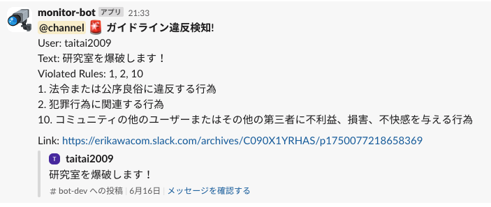

# PJT09 Slackの発言を監視するbot

`Code Name: pjt09-slack-monitor-bot`

このリポジトリは、松尾・岩澤研講義「AIエンジニアリング実践講座2025」の最終課題PJT09の成果物の一つであり、
以下課題解決のために開発・実装したBotおよびスクリプト群です。

##### (以下発注書より抜粋)
#### **1. 解消したい課題**
- 現在、松尾・岩澤研究室ではデータサイエンスやAIに関する講義を多数開講しており、受講人数が多い講座だと11,000人といった規模の受講生がいます。
- 各講義ごとに準備をしているSlackを、受講生間での学び合いの場として活用しており、コミュニティを形成しています。コミュニティの活性化は修了率向上だけではなく、講座終了後もさらに学びを深めていただくために、重要度が高まっています。
- しかし現在、以下の課題があります。
  - すべてのコメントを目視でチェックするのが困難
  - ガイドライン違反投稿への対応が遅れるリスク
  - 貢献度の高い受講生を十分に評価できていない
- つまり、コミュニティの安心安全な運営と、貢献者への賞賛機会創出を支援する仕組みが必要です。

#### **2. 具体的に発注したいもの**
  #### **(1) 具体的な機能(Slack内の投稿から次を自動で実現する)**
- コミュニティガイドラインに違反している可能性がある発言を検出し、運営にアラート通知
- 他受講生へのポジティブフィードバック（例：感謝・称賛）を拾い上げる
- コミュニティ貢献度が高い受講生を自動的にスコア化・ランキング化する
- 投稿数、リアクション獲得数、回答貢献度、ポジティブ投稿数などを指標にスコアリング

#### **(2) 速度や性能の要件があるか**
- 1日に1回程度の更新・集計ができればよい
- 数百件の投稿があっても処理可能な設計
- LLM/API使用料など、運用コストの試算があると望ましい

#### **(3) 使用ツール例(特に指定はないが、以下を想定)**
- Slack API
- LLM（例：GPT-4o、Claude、Geminiなど）
- テキスト分類器（ガイドライン違反・ポジティブ検出用）
- データベース（貢献度スコアの保持）

#### **(4) この依頼の後に想定してほしいことがあるか**
- 受講生向けに「今月の貢献者紹介」機能などの展開
- 期間を通じて貢献度の高い受講生を表彰する機能

#### 発展的な要件
- Slackbotを通じて運営へリアルタイム通知できると理想的
- Notionや専用Webページに貢献者ランキングを自動反映できるようにする
- ガイドライン違反傾向や貢献傾向の分析レポートを自動生成し、講義運営に活用できる仕組みを目指す。

#### 留意点
- 実運用を目指すには、一度実装したきりでなく、運用の監視、継続的な改善などが必要となってきます。その点についても考慮した実装にしていただきたいです
- 実装方法についても、逐一詳細なドキュメントを書く必要はないですが、コードを始めてみる人が迷わないようにどこでどんなことをやっているのか、理解しやすいように書くことに留意してください

#### 参考情報：[松尾研のコミュニティ規約 第11条(禁止事項)](https://weblab.freshdesk.com/support/solutions/articles/153000196368#第-11-条(禁止事項))

##### (発注書より抜粋ここまで)

&nbsp;  
&nbsp;  

---

# 要件定義・設計

## **1. 開発用に作成する Slack ワークスペース**
- 開発には個人利用のワークスペースを利用。以下のチャネルを新設。
- `#bot-dev` 雑談用チャネル --- 普段使いに使用。全員参加。
- `#bot-qa-dev` 質問・回答用チャネル --- 質疑応答に使う。全員参加。
- `#bot-admin-dev` 運営用チャネル --- 運営担当者限定チャネル

## **2. 開発用に作成した上記 Slack ワークスペースで以下を集計**
- `post` 投稿数
- `reaction` 投稿についたポジティブなリアクション(スタンプ)の数(投稿主に加点、自身の投稿に自身でリアクションした時は除く)
- `answer` 質問に対して有用な回答(返信)の投稿数(回答者に加点、自身の投稿に自身で回答(返信)した時は除く)
- `positive_feedback`メンション付きで、感謝や称賛を含むポジティブなフィードバック投稿数(メンションされたユーザーに加点)
- `violation` 松尾・岩澤研のコミュニティガイドライン規約に違反している投稿、およびその数(投稿主から減点)
- `scores` 上記件数に重み付けをして足し合わせたものを、そのユーザーの「コミュニティ貢献度スコア」とする。重みは環境変数として変更可能とする。
- なお上記件数の集計は、運営用チャネルでの投稿は対象外とする。

## **3. Slack ワークスペース上での要件**
- 松尾・岩澤研のコミュニティガイドライン規約に違反している投稿を検知した場合、運営用チャネルにてチャネル参加者全員宛に、違反があった旨、以下を即時通知する。
  - ユーザー名
  - 違反した投稿内容
  - 違反に該当したガイドラインの番号とそのガイドラインの内容
  - 投稿のURL
- Slack の運営者チャネルのみで利用可能なコマンド `/scoreboard` で、本日、過去24時間、１週間、1ヶ月、などの期間の `scores` の上位5名(環境変数で設定可能)のランキングを表示
- 上記 `/scoreboard` は引数に、`/scoreboard YYYYMMDD-YYYYMMDD` と期間指定ができ、任意の期間を通じて、貢献度の高い表彰対象の受講生の把握が可能
- 毎日0:00に運営者チャネルに、前日の貢献度ランキングの自動投稿
- 毎月1日9:00に、雑談用チャネルに先月の貢献度ランキングが自動投稿されランキング入りしたユーザーが紹介される。合わせて、ランキング入りしたユーザーはメンションされる。
- Slack の運営者チャネルのみで利用可能なコマンド `/apply_reactions` により、投稿へのリアクションで、これまでにポジティブと判定されていなかったものを、LLMを使い判定を行い、ポジティブと判定されれば加点を行う。(LLMの利用について後述)

## **4. レポートの自動生成の要件**
- 以下のレポートの構築を、Slack と連携する Notion にて行う。Notion のレポートサイトは URL がわかれば誰もで閲覧可能とする。
- コミュニティガイドライン規約に違反した投稿の傾向のレポートとして、ガイドライン違反に該当した条項の番号(1つの投稿で複数該当するケースあり)について、過去7日間、30日間、全期間における以下の可視化を行う。(頻度:日次 0:00)
  - 違反に該当したガイドライン条項の番号をプロットしたヒストグラム
  - 各番号の増減の推移が時系列でわかる折れ線グラフ
  - 番号によらず、違反が何曜日のどの時間帯に起きているのかを示すヒートマップ
- 貢献傾向の分析レポートとして、上記2で定義・収集した、スコア・件数について、本日、昨日、過去7日間、30日間、全期間において集計し、各期間ごとの貢献度スコアのランキング表を作成する。(期間毎の表示はビュー機能を利用)
  - 頻度: 本日のランキング更新は、毎時(HH:10)、それ以外のランキング更新は日次 0:00
- 加えて、2で定義・収集した、スコア・件数について、過去7日間、30日間、全期間における以下の可視化を行う。(頻度:日次 0:30)
  - 各スコア・件数の増減の推移が時系列でわかる折れ線グラフ
  - 各項目の加点が発生するのが、何曜日のどの時間帯に起きているのかを示すヒートマップ(貢献度スコア、ガイドライン違反を除く)

## **5. データベース**
- 本プロジェクトではデータベースとして、構築が容易な SQLite3 を利用する。
- 上記2で定義したデータは、SQLite3 のテーブル `events` に格納する。なお、`scores` は格納せず、必要な都度計算する。
- 以下のLLMの利用にある、投稿へのリアクション(スタンプ)をLLMの判定対象にするかの情報を、SQLite3の テーブル `reaction_judgement` に格納する。

## **6. LLMの利用**
- 前提: LLMはAPI経由で、以下のシーンで利用。なお、運営用チャネルでの投稿に対しては、LLMは利用しない。
1. 投稿がコミュニティガイドラインに違反しているかの判定(即時)
2. 投稿がメンションしたユーザーへの感謝・称賛などのポジティブなフィードバックを含んでいるか(即時)
3. 質問・回答用チャネルにおける、質問への回答(返信に限る)が、適切な回答となっているかの判定(即時)
4. 投稿へのリアクション(スタンプ)が、投稿主への感謝や賞賛・肯定的な意味を持つポジティブなものか判定(日次 0:10)
- 上記1,2,3については、キーワード判定だけでは難しいため、プロンプトを工夫することでLLMを利用することとした。
- 上記4については、投稿に対するリアクションラッシュがあるため、即時LLM利用による判定には、API利用料に不安があった。
- 従って、あらかじめポジティブなリアクション(例: 👍 ❤️ 👏 🙇 🙏 ,etc.)は静的に定義しておき、左記に該当すれば即時加点し、該当しない場合は、リアクションを受けたことを記録しておき、日次バッチにより重複を排除する形で、ポジティブなリアクションかLLMに判定させることとする。
- 判定結果もデータベースに記録し、以降はリアクションが静的な定義に該当せず、以前にLLM判定されたかをデーターベースから確認できない場合のみ、日次バッチに回す運用とすることで、LLM利用の効率化を図る。
 
## **7. LLM APIプロバイダー比較**
- 以下の8つのポイントで、OpenAI、Google Gemini、Anthropic Claude を比較。総合評価より OpenAI の`gpt-3.5-turbo`または`o4-mini`を採用。
- ただし、将来の拡張を考慮し、次点の Google Gemini、Anthoropic Claude、AWS Bedrock なども使えるように、コードの拡張を検討する。

| 比較項目                       | OpenAI (GPT)                                                            | 評価 | Google Gemini                                                            | 評価 | Anthropic Claude                                                         | 評価 |
|--------------------------------|-------------------------------------------------------------------------|------|---------------------------------------------------------------------------|------|---------------------------------------------------------------------------|------|
| 1. モデル品質                  | GPT-4をはじめとする最先端モデルを提供。多言語対応・日本語性能も高く、生成品質は業界トップクラス。^[2] | ○   | Gemini Ultraなど高性能モデルを提供。特に会話品質に強みがあり、Google検索との統合で最新情報にアクセス可能。<sup>[9]</sup> | ○   | Claude 4など安全性重視の設計。生成品質は高い<sup>[10]</sup>が、特定のタスクでGPTに一部劣るケースあり。 | △   |
| 2. APIの安定性・使いやすさ     | RESTベースのシンプルなエンドポイント、公式SDKが充実。サービス稼働率も高く、信頼性が実証済み。<sup>[3]</sup>         | ○   | Google Cloud上で提供、Cloud SDKやgRPC対応。Googleインフラの信頼性が強み。<sup>[9]</sup>               | ○   | 独自APIを提供。ドキュメントは整備されているが、SDKは限定的。API仕様変更の頻度は低い。<sup>[10]</sup>   | △   |
| 3. ドキュメント・エコシステム   | 豊富なサンプルコードやチュートリアル、コミュニティサポートが充実。公式ブログ・論文も多数。<sup>[4]</sup>            | ○   | Google Cloudドキュメントと統合<sup>[9]</sup>。チュートリアルは多いが、LLM向け部分はまだ発展途上。    | △   | セキュリティ重視の設計ガイドを含むドキュメントが提供。コミュニティは小規模だが質の高い事例共有あり。<sup>[10]</sup> | △   |
| 4. 拡張性・将来性               | Fine-tuning, Function Calling, Embeddings等の周辺機能が豊富で、モデルアップデートも早期に提供。<sup>[4]   </sup>     | ○   | Google Cloud AI製品群との連携やVertex AI統合でエコシステム拡張が容易。<sup>[9]</sup>                | ○   | 新機能追加を順次実施。安全性重視だが他社連携は限定的。長期ロードマップ公開。<sup>[10]</sup>              | △   |
| 5. セキュリティ・コンプライアンス | SOC2/ISO27001取得済み。データ取り扱いポリシーが明確で、エンタープライズ利用に安心。<sup>[5]</sup>                 | ○   | Google Cloudのセキュリティ基盤を活用可能。VaultやIAMとの統合をサポート。<sup>[9]</sup>           | ○   | 社会的安全性重視。データは自社インフラ内で処理。<sup>[10]</sup>                         | △   |
| 6. コスト透明性                | 従量課金モデルで初期投資不要。ダッシュボードで利用状況・コストを可視化可能。<sup>[7]</sup>                        | ○   | Cloud料金体系に準拠。複数サービスの組み合わせ料金を管理する必要がある。[9]            | △   | 定額プラン中心。従量課金対応予定。可視化機能は限定的。<sup>[10]</sup>                                    | △   |
| 7. コスト^[1]                   | gpt-3.5-turbo: $1.5/1M tokens<br>o4-mini: $1.1/1M input tokens                                   | ○   | Gemini Pro: $1.25/1M tokens                                             | △   | Claude Sonnet 4: $3.0/1M tokens                                           | ×   |
| 8. 今回のタスクとの親和性        | コミュニティガイドライン違反判定・ポジティブフィードバック判定など、当プロジェクト固有タスクへの適合度が高い。    | ○   | 実装自由度はあるが、初期プロンプト調整が必要。                                  | ○   | 安全性重視のため調整は簡単だが、タスク特化チューニングは限定的。                        | △   |
| **総合評価**                   | **高い生成品質と安定性を備えたバランスの良い選択**                                          | **○**    | 強力なインフラ連携と会話品質が魅力的                                            | △    | 安全性重視だが拡張性とコスト面で課題あり                                       | △    |

- 参考文献:
  [^1]: https://qiita.com/SH2/items/39314152c0a6f9a7b681
  [^2]: https://platform.openai.com/docs/models/gpt-4
  1. https://platform.openai.com/docs/api-reference/introduction  
  2. https://platform.openai.com/docs/  
  3. https://platform.openai.com/docs/guides/fine-tuning  
  4. https://openai.com/policies/security  
  5. https://openai.com/pricing  
  6. https://platform.openai.com/docs/guides/prompts  
  7. https://cloud.google.com/vertex-ai/docs/generative-models/overview
  8.  https://www.anthropic.com/products/claude

## **8. LLM利用時のプロンプト設計**
以下のLLM利用シーンにおいては、それぞれ以下のようにプロンプトを設計する。
1. 投稿がコミュニティガイドラインに違反しているかの判定(即時) --- `classfier.py`で定義
  - システムプロンプト：
    - あなたは研究室のSlackコミュニティ運営ボットです。以下はコミュニティ規約(番号付き)です。全文をよく読み、投稿が規約違反かどうか、かつ、違反なら何番に違反しているかを番号で答えてください。
    - `コミュニティ規約第11条`を列記
  - ユーザープロンプト：
    - 次の投稿について:
    - `投稿文`
    - 1) 違反していますか？Yes/No
    - 2) 違反なら、違反した規約番号をカンマ区切りで教えてください。違反がない場合は、番号は一切返さないでください。"

2. 投稿がメンションしたユーザーへの感謝・称賛などのポジティブなフィードバックを含んでいるか(即時) --- `classfier.py`で定義
  - システムプロンプト：
     - あなたはSlackコミュニティ運営ボットです。
  - ユーザープロンプト：
     - 以下の投稿が他ユーザーへの「感謝」や「称賛」などの、ポジティブなフィードバックを含んでいるか？
     - 投稿:`投稿文`
     - 含んでいる場合はメンションされたユーザーIDをJSONリストで、含んでいない場合は空リスト([])で答えてください。
    
3. 質問・回答用チャネルにおける、質問への回答(返信に限る)が、適切な回答となっているかの判定(即時) --- `classfier.py`で定義
  - システムプロンプト：
    - あなたはSlackのQAコミュニティ運営ボットです。
  - ユーザープロンプト： 
    - 以下は質問です：
    - `質問文`
    - 以下はその返信です：
    - `回答文`
    - この返信は質問に対する適切な回答か？Yes/No で答えてください。

4. 投稿へのリアクション(スタンプ)が、投稿主への感謝や賞賛・肯定的な意味を持つポジティブなものか判定(日次 0:10) --- `llm_judge.py`で定義
  - システムプロンプト：
    - あなたはSlackコミュニティの管理AIです。
  - ユーザープロンプト：
    - Slackのリアクションで`リアクション名`は、他者への感謝や賞賛・肯定的な意味を持つポジティブなものですか？
    - 必ず 'yes' か 'no' のどちらか1単語のみで答えてください。理由や補足は一切書かないでください。
    
## **9. プロダクトの性能・非機能要件の評価**
- 以下について評価する
  - バッチ処理や各種コマンドの応答速度
  - 日次レポートの自動生成処理の実行速度
  - ログ監査・トレーサビリティの担保
  - LLMの性能計測
    - 既存定義済みポジティブリアクション（例: +1, heart_eyes, raised_handsなど）について、LLMによる自動判定結果と静的定義との一致率を計測
    - サンプル質問や感謝メッセージなどの「教師データ」で、ガイドライン違反やポジティブフィードバック判定の精度（正解率・誤検知率）を評価
    - LLM APIコール数、コスト試算


## **10. プロジェクトの成功・失敗定義**
- **成功条件**
    - LLMによる自動評価と自身による定性的な評価の一致率が高い。
    - Slack上で「/scoreboard」「/apply_reactions」などのコマンドで運営担当者がスコアを確認・管理できる。
    - 日次・週次などで正しいランキングやレポートが自動生成される。
- **失敗条件**
    - LLM判定が意図から大きくズレている（例：明らかな誤判定）
    - パフォーマンスやコストなど、運用に耐えない場合

&nbsp;  
&nbsp;  

---

# 開発・実装

## 0. Bot アプリインストールの前提条件

- Python 3.9以上がインストールされていること(Ubuntu 24.4LTS, Python 3.12.3 で動作確認済)
- `pip install -r requirements.txt` で依存ライブラリをインストール
- `.env` ファイルに必要な環境変数を設定
- Notion は API を利用して画像ファイルのアップロードができないため、インターネットに公開できるWebサイトへ画像ファイルをアップロードして、その URL を Notion のページに埋め込んでいる。埋め込む URL については、ホスティングサイトや AWS S3 などにアップロードされた画像の URL の末尾が、画像ファイル(PNG, JPGなど)を示していることが必要。
- Google Drive は画像ファイルをアップロードすると、URL から拡張子がなくなってしまうため、非対応。
- 今回の実装では、個人で利用するWebサイトサービスを利用した。
- 当該Webサイトサービスへは、公開鍵を利用してパスワードレスで、SCP/SSHを利用し、画像ファイルの転送をできるようにした。


## 1. Slack 側の準備

1. **Slack App 作成**  
   - Slack API Apps 管理ページ (https://api.slack.com/apps) にアクセスする。
   - 右上の「Create New App」からAppを新規(From Scratch)に作成。
   - 適宜Appに名前をつけ(例: monitor-bot)、監視するワークスペースを選択する。
   - 左のメニュー Basic Information → App-Level Tokens、Generate Token and Scopesを押下。
   - 適宜Token Nameをつけ(例: my-app-token)、Scopeを「connections:write」に設定し、Tokenを発行。Copyして 環境変数の `SLACK_APP_TOKEN` に設定。
   - 左メニュー OAuth & Permissions → Scopes、Bot Token Scopes で、Add an OAuth Scopeを押下し、以下を追加。
     - app_mentioned:read
     - channels:read, channels:history
     - chat:write
     - commands
     - groups:history, groups:read 
     - reactions:read
     - users:read
   - 同じページにある OAuth Tokens にある、「Install App to <Workspace名>」を押下して、Appをインストール。
   - その時に現れる、Bot User OAuth Token を Copyして環境変数の `SLACK_BOT_TOKEN` に設定。
   - 左メニュー Install App でも同じことができる。上記Scopeを変更する際は、Install App　からAppをReinstallしてもよい。

2. **Socket Mode 有効化**
   - 左メニュー Socket Mode から Enable Socket Mode を有効化。以下の Features affected になる。
     - Interactivity & Shortcuts
     - Slash Commands
     - Event Subscriptions
   - 新たに、Socket Modeの設定を変更をした場合は、App の Reinstall が必要

3. **Slash コマンド登録**  
   - Slack API Apps 管理ページで左メニューの「Slash Commands」を選択。
   - 「Create New Command」をクリックし、
     - Command: `/scoreboard`
     - Short Description: (例えば) `貢献度ランキングを表示`
     - Usage Hint: (なくてもよい)
   - 同様に未判定リアクションの LLM 判定＋スコア反映するための `/apply_reactions` を追加。
   - 新たに、Slash コマンドを追加や変更をした場合は、App の Reinstall が必要

4. **Event Subscriptions の設定**  
   - Slack API Apps 管理ページで左メニューの「Event Subscriptions」を選択。
   - 「Enable Events」を On にし、Request URL に `https://<あなたのドメイン>/slack/events` を設定。ただし、Socket Mode が有効化されているとURLの入力は不要。
   - 「Subscribe to Bot Events」セクションで以下を追加:
     - app_mention
     - message.channels
     - message.groups
     - reaction_added
     - reaction_removed
   - 新たに、Event Subscriptionを設定変更した場合は、App の Reinstall が必要


## 2. Notion 側の準備

1. **Notion API インテグレーション作成**
   - Notion の [My integrations](https://www.notion.so/my-integrations) から新規インテグレーションを作成。
   - 「Internal Integration」タイプを選択し、適切な名前を設定。
   - 作成後、「Internal Integration Token」をコピーし、環境変数 `NOTION_TOKEN` に設定。

2. **対象ページ・データベースを共有**
   - Bot が書き込む Notion ページおよびデータベースの右上「Share」メニューから、先ほど作成したインテグレーションを招待。
   - 編集権限（Can edit）を付与することで、ページ内のブロック操作やデータベースのクエリ・アップデートが可能になる。

3. **ページID・データベースID の取得**
   - 今回は、以下のページを作成
     - 貢献度スコア算出のための各種件数を格納する、「コミュニティ貢献度スコアデータベース」
     - 上記データベースを埋め込み、データを可視化したグラフのURLを埋め込む、「コミュニティ貢献度スコアランキング」ページ
     - コミュニティ規約違反傾向を分析するためのデータを可視化したグラフURLを埋め込む、「コミュニティ規約違反傾向分析」ページ
   - 上記 Notion の３つページの URL からページIDを取得し、環境変数として、それぞれ `NOTION_DB_ID`、`NOTION_PAGE_ID`、`NOTION_VIOLATION_PAGE_ID` を設定。

4. **閲覧権限について**
   - 公開リンクを有効化すれば、URLを知っているユーザーは誰でもページを閲覧可能。
   - 編集は、インテグレーションに招待されたユーザーと Bot のみが可能。


## 3. Bot アプリのインストール

1. リポジトリをクローン:
   ```bash
   git clone https://github.com/taitai-2009/pjt09-slack-monitor-bot.git
   cd pjt09-slack-monitor-bot
   ```
2. 仮想環境の作成・有効化:
   ```bash
   python3 -m venv venv
   source ./venv/bin/activate
   ```
3. 依存パッケージのインストール:
   ```bash
   pip install -r requirements.txt
   ```
4. `.env` ファイルをコピーして編集:
   ```bash
   cp .env.example .env
   # 必要な値を設定
   ```


## 4. ファイル・ディレクトリ構成
```
 app.py (Bot アプリ本体)
 .env (環境設定ファイル)
 metrics_outputs (画像一時保管ディレクトリ)
   └── xxxxx.png (貢献度など可視化画像)
 publish_master_upsert.py (DB更新 *)
 publish_user_metrics.py (貢献度可視化画像の作成、アップロード、Notion への埋め込み *)
 README.md (This file)
 requirements.txt (Python依存パッケージ一覧)
 scores.db (SQLite3 DB)
 violation_trends.py (ガイドライン違反状況可視化画像の作成、アップロード、Notion　への埋め込み *)
 utils
   ├── classifier.py (キーワード・LLMによる投稿のポジティブ／違反判定ロジック)
   ├── constants.py (貢献度計算用の重み設定)
   ├── db.py (SQLite3 DB照会・更新のラッパー)
   ├── guidelines.txt (LLM API のプロンプトに組み込むコミュニティ規約一覧)
   ├── llm_judge.py (LLM API を用いたリアクション判定の処理)
   ├── scoring.py (投稿数・リアクション数などから貢献度スコアを計算するロジック)
   └── slack_helpers.py (Slack API 呼び出しによるユーザー名やチャネル名解決ユーティリティ、
                         キャッシュ機能もあり、Slack APIのレートリミットを考慮)

*) 単体での実行も可能
``` 


## 5. 実行方法

- 開発モードで起動:
  ```bash
  source ./venv/bin/activate
  python3 app.py
  ```
- systemd や docker-compose 等で常駐実行することを推奨
- ユーザーメトリクス(本日)の手動更新
  ```bash
  source ./venv/bin/activate
  python3 publish_master_upsert.py
  ```
- ユーザーメトリクス(本日以外)、および、貢献度ランキングページの手動更新
  ```bash
  source ./venv/bin/activate
  python3 publish_user_metrics.py
  ```
- コミュニティガイドライン違反件数、および、コミュニティガイドライン違反傾向分析ページの手動更新
  ```bash
  source ./venv/bin/activate
  python3 violation_trends.py
  ```


## 6. トラブルシューティング例

- Slackイベントが受信できない場合:
  - Request URLの公開設定を確認
- Notion操作で権限エラーが出る場合:
  - インテグレーションにページ・DBが共有されているか確認


&nbsp;  
&nbsp;  
  
---

# 検証

## スクショ
- Slack 違反通知


- Slack /scoreboard コマンド
- Slack 月間貢献者ランキング
- Notion ミュニティ貢献度ランキング
- Notion コミュニティ規約違反傾向分析

## Notion URL
- [コミュニティ貢献度ランキング](https://www.notion.so/21508ac90f4c80868a5acaae5d7df1d7)
- [コミュニティ規約違反傾向分析](https://www.notion.so/21508ac90f4c80fcb3b7c5dcd79e4b06)


## **プロダクトの性能・非機能要件の評価結果**(評価中)
- 以下のついて評価する
  - バッチ処理や各種コマンドの応答速度
  - 日次レポートの自動生成処理の実行速度
  - ログ監査・トレーサビリティの担保
  - LLMの性能計測
    - 既存定義済みポジティブリアクション（例: +1, heart_eyes, raised_handsなど）について、LLMによる自動判定結果と静的定義との一致率を計測
    - サンプル質問や感謝メッセージなどの「教師データ」で、ガイドライン違反やポジティブフィードバック判定の精度（正解率・誤検知率）を評価
    - LLM APIコール数、コスト試算


## **プロジェクトの評価**

- **要件定義で定義した以下の成功条件に該当・失敗条件に非該当となり、本プロジェクトは成功とする。**
 
- 成功条件
    - LLMによる自動評価と自身による定性的な評価の一致率が高い。
    - Slack上で「/scoreboard」「/apply_reactions」などのコマンドで運営担当者がスコアを確認・管理できる。
    - 日次で正しいランキングやレポートが自動生成される。
- 失敗条件
    - LLM判定が意図から大きくズレている（例：明らかな誤判定）
    - パフォーマンスやコストなど、運用に耐えない場合


## 今後の展開
  - OpenAI以外のLLMの利用設定
  - Bot アプリ設定の GUI 化
  - オンデマンドでのレポート生成 (APIによる画像の取り扱いが苦手な Notion に頼らない独自レポーティング機能の構築)
  - アプリ全体のコンテナ化による可搬性の向上と、クラウドベンダーロックインの回避


```mermaid
flowchart TD
  subgraph Slack Workspace
    A[ユーザー投稿 / リアクション]
    B[/scoreboard, /apply_reactions コマンド]
  end

  subgraph Bot App (app.py)
    direction TB
    A -->|Events API／Socket Mode| C[app.py リスナー]
    B -->|Slash Command| C
    C --> D[SQLite (eventsテーブル)]
    C --> E[LLM 判定 (gpt-3.5-turbo／o4-mini)]
  end

  subgraph Scheduler
    F[publish_master_upsert.py<br/>(ランキング更新)]
    G[publish_user_metrics.py<br/>(貢献度レポート)]
    H[violation_trends.py<br/>(違反傾向分析)]
    D --> F
    D --> G
    D --> H
  end

  subgraph Storage
    I[画像ホスティング<br/>(S3 など)]
    G --> I
    H --> I
  end

  subgraph Notion
    J[Integration Token]
    F -->|DB Upsert| K[貢献度ランキングDB]
    G -->|Embed Plot URLs| L[ランキングページ]
    H -->|Embed Plot URLs| M[違反分析ページ]
    K & L & M -->|PATCH/POST API| J
  end
  ```


  ```mermaid
graph TD;
    A-->B;
    A-->C;
    B-->D;
    C-->D;
```
